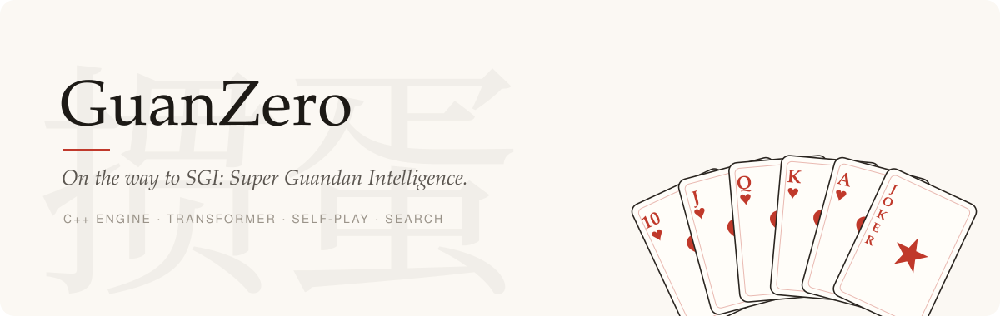
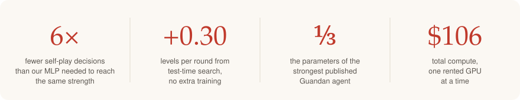
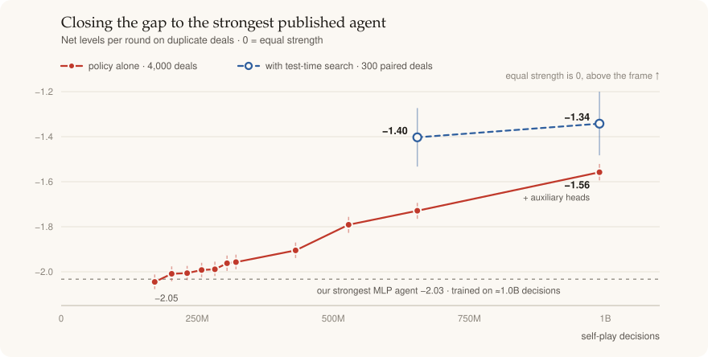
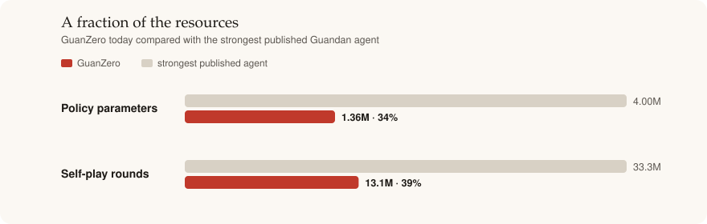
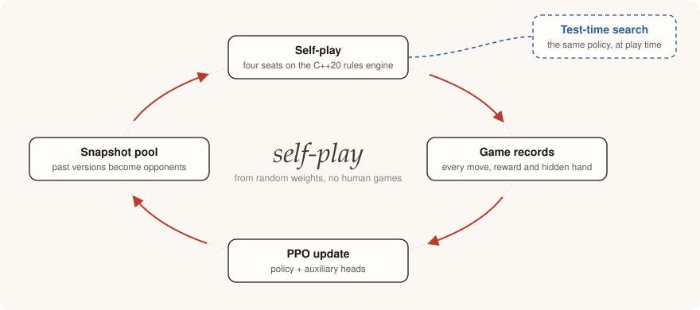

<p align="center">
  
</p>

<p align="center"><i>A Guandan agent that starts from random weights and learns only by playing against itself.<br>
No human games, no imitation, no hand-written play strategy.</i></p>

<p align="center">
  
</p>

## The game

Guandan is a four-player team card game played with two decks. Partners sit across from each other, each holding 27 of the 108 cards, and race to empty their hands. The winning team climbs levels from 2 to A over a match of many rounds, and losers pay tribute cards to the winners before the next round starts.

For an AI it combines three hard problems at once:

- **Hidden information.** Three hands are unseen and have to be inferred from play.
- **Silent teamwork.** Partners cooperate without communicating, against a pair doing the same.
- **A large, structured action space.** Wild cards, bombs and combinations give hundreds of legal moves in some positions.

## Where it stands

<p align="center">
  
</p>

Measured against the strongest published Guandan agent on duplicate deals, where every deal is replayed with the teams swapped. The gap has shrunk from **−2.05** to **−1.56** levels per round over about 1B self-play decisions, and test-time search takes it to **−1.34**. The Transformer matched our strongest MLP after only 172M decisions and now beats it head to head by +0.67 levels per round.

<p align="center">
  
</p>

On the public [Botzone](https://www.botzone.org.cn/) Guandan ladder the plain policy, without search, reached rank 40 on October 3, 2026. Sources: [strength summary](docs/reports/strength-summary-2026-10-04.md).

## How it learns

<p align="center">
  
</p>

- **Engine.** `gd_core`, a C++20 rules engine specified line by line in [RULES.md](docs/RULES.md).
- **Model.** A 1.36M-parameter Transformer that reads the whole match as a token stream, with auxiliary heads for the next move, the hidden hands and the round outcome.
- **Training.** PPO against the current network and its own past snapshots. The only scripted part is a fixed tribute rule between rounds.
- **Search.** When someone is close to going out or the policy is unsure, the agent samples hidden hands and compares its best moves by rollouts.

## Open questions

The experiments so far raised three questions this project is now built to study.

1. **Can an agent learn its opponents' habits within a match?** The model can see the whole match, but [an ablation](docs/reports/history-ablation-2026-09-29.md) shows it hardly uses earlier rounds. Self-play opponents may have no habits worth learning; a population of opponents with distinct styles might change that ([plan](docs/reports/opponent-diversity-plan-2026-10-03.md)).
2. **How should search and learning fit together in a hidden-information team game?** Search helps (+0.30 levels per round), but sampling hidden hands from the learned belief head is not yet better than sampling uniformly.
3. **Can variance reduction make each decision of training count for more?** In a four-player game most of the noise in the learning signal comes from sampled actions rather than critic error ([design](docs/reports/vrpo-design-2026-10-04.md)).

## Built to be trusted

- **An independent rules oracle.** `oracle/gd_reference.py` was written separately from the engine. They agree on 100,000 `interpret` cases, all 37,636 `beats` pairs and 10,000 move-generation hands, with 0 mismatches.
- **Fuzzing.** 10,000,008 rounds and 735,492,869 decisions with every invariant checked; 100,002 rounds clean under UBSan.
- **Rules parity with an external engine.** 70 rounds with zero tribute, finish-order or reward mismatches against the reference agent's own engine.
- **Measured claims.** Strength claims come with confidence intervals on duplicate deals, A/B tests are paired, and results that showed no effect are kept. There is one report per experiment in [`docs/reports/`](docs/reports/).

<details>
<summary><b>Engineering: making self-play fast</b></summary>

<br>

Rollout collection is bound by the Python host thread, not by the GPU, so most of the speed work cuts host work per decision. Every optimization is checked for bitwise-identical results against the original path.

| Change | Result | Hardware | Report |
|---|---|---|---|
| CUDA Graphs + batched attention + Triton KV-cache kernel in rollout collection | **3.48x** decisions/s (1,030 → 3,587), bitwise-identical FP32 on all 30 replays | RTX 4090 | [history-cuda-throughput-2026-09-28](docs/reports/history-cuda-throughput-2026-09-28.md) |
| Causal SDPA + batched KV cache instead of dense attention | **1.76x** full-update throughput; reserved GPU memory 24.74 GB → 0.145 GB | RTX 4090 | [history-stack-cuda-2026-09-26](docs/reports/history-stack-cuda-2026-09-26.md) |
| 4 actor processes sharing one GPU | **1.78x** decisions/s (1,871 → 3,324); GPU utilization 55% → 82% | RTX 4090 | [history-actor-ranks-2026-09-28](docs/reports/history-actor-ranks-2026-09-28.md) |
| Learner length groups + page-padded rollout attention + paged KV cache (opt-in) | **1.71x** per training update; learner 2.4x | Apple M4 Pro CPU | [training-stack-refactor-2026-09-29](docs/reports/training-stack-refactor-2026-09-29.md) |
| C++ rules engine, random play, canonical move generation | **190,533** decisions/s on one core; **1,839,581** on 12 threads | Apple silicon, 14 cores | [M0](docs/reports/M0.md) |

**A rejected idea.** torch.profiler showed about 300 kernel launches per rollout step. A two-stage in-process pipeline made collection 1.4–2.2x *slower*, because splitting each batch doubled the per-decision host cost ([perf-pipeline-2026-09-25](docs/reports/perf-pipeline-2026-09-25.md)). That led to the two changes that did work: CUDA Graphs, which cut launches per step, and separate actor processes.

**How changes are measured.** Same-host A/B trials in interleaved orders (for example `ABDEEDBA`) with warmup discarded; replay digests compared for bitwise parity, with deterministic CUDA algorithms on (a CUDA `index_add_` was shown to be nondeterministic); torch.profiler, cProfile and nvidia-smi for profiling. Throughput, numerical parity and playing strength are reported separately: a faster component is never claimed to make a better player.

</details>

## Repository

| Path | Contents |
|---|---|
| `cpp/` | `gd_core` C++20 engine, unit tests, fuzzer |
| `python/gd/` | pybind11 package (`gd._gd_core`) |
| `oracle/` | independent Python rules oracle, used only in tests |
| `train/` | PPO trainer, history Transformer, KV caches, CUDA Graphs, Triton kernel, actor ranks |
| `eval/` | duplicate-deal arenas, external-agent bridges, test-time search, Botzone bot |
| `bench/` | throughput benchmarks |
| `docs/` | rules, design, training guide and one report per experiment |

## Build and test

```sh
python -m pip install -r requirements-dev.txt -r requirements-train.txt
cmake -S . -B build -G Ninja -DCMAKE_BUILD_TYPE=Release
cmake --build build -j
./build/cpp/tests/gd_tests          # C++ unit tests
python -m pytest -q tests oracle    # Python suites and oracle cross-checks
```

The rules are specified in [docs/RULES.md](docs/RULES.md), the system design in [docs/DESIGN.md](docs/DESIGN.md), and training entry points in [docs/TRAINING.md](docs/TRAINING.md).
