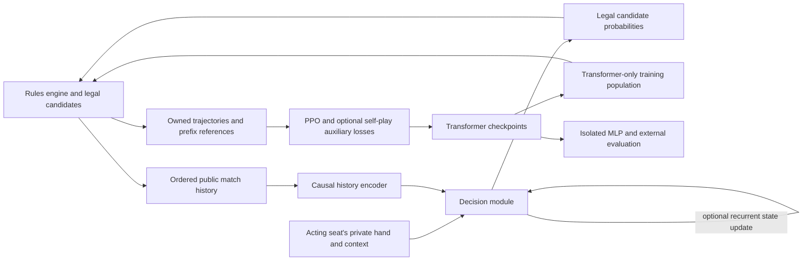

# GuanZero: system design

Status: v0.6, owner decisions consolidated September 25, 2026.
This is the baseline research and implementation contract. Later implementation
receipts and proposals are indexed in [STATUS.md](STATUS.md); the deferred
list here records the baseline scope, not current component availability.
It replaces the former
MLP-continuation, belief-gated history and MLP-distillation roadmaps.
Implementation tasks: [STAGE_C_TODO.md](STAGE_C_TODO.md).
Operator guide: [TRAINING.md](TRAINING.md).
Rules and engine contracts: [RULES.md](RULES.md), [STATE_SPEC.md](STATE_SPEC.md),
[MOVEGEN_SPEC.md](MOVEGEN_SPEC.md), [PY_API.md](PY_API.md).

## 1. Summary

Train a history-aware Transformer policy from random initialization through
self-play reinforcement learning. Existing MLP players are frozen evaluation
baselines only. Compare a standard history Transformer with a looped decision
module, both trained from scratch. Playing strength and compute cost decide
whether the extra internal computation is useful.

### 1.1 Training boundary

- No old MLP actor or critic weights, optimizer state, distillation, action
  labels, replay datasets, training opponents or training partners.
- No frozen-M1 candidate ranking, top-k pruning or KL penalty toward an old
  MLP. PPO's comparison with the collecting Transformer policy remains valid;
  it is distinct from regularization toward a separate MLP teacher.
- Training seats use the current Transformer and snapshots generated by
  its own training lineage. Independent Transformer seeds can later provide
  diversity, with the same population protocol across comparison arms.
- Evaluation against MLPs, rule bots, styled bots or external models is
  isolated from training. Those trajectories do not enter any learner,
  auxiliary dataset, reward-shaping fit or training pool.
- All new learned modules start randomly, including the critic and action
  head. Reusing engine code, layer implementations and tensor layouts is
  allowed. An ordinary feed-forward layer inside the new network does not
  import the old MLP player's learned strategy.

### 1.2 Success criteria

First establish a correct cold-start training loop, then measure learning
against immutable MLP checkpoints on paired deals and full matches. Beating
an old MLP establishes that comparison only; it does not establish external
state of the art. A looped model must also be compared with a standard history
Transformer at controlled training and inference budgets.

The original M0 engine acceptance is recorded in [reports/M0.md](reports/M0.md).
The original Rule One--Four, DanZero, SDMC and GS2 checkpoint ladder was
unavailable in that audit; do not report those historical gates as achieved
using substitute opponents. External evaluations must identify their actual
opponent, rules, action adapter and inference budget.

### 1.3 Scope

The first experiment learns card play. Retain the existing fixed heuristic
for tribute/back-tribute, identically across arms, and log those public
exchanges. This exception does not put heuristic players into play-phase
training seats. Learned tribute, engine-based search, human timing features
and multi-node training are later work. Human games require participants to
know they are playing a bot.

## 2. Evidence and research questions

Ordered actions provide evidence about hidden hands and behavior that
cumulative card counts can discard. A pass is probabilistic evidence whose
meaning depends on the previous play, teammate/opponent roles and later
card consumption; it is not proof that a player lacks a particular type.

The corrected historical belief experiment found no stable extra gain from
history over its no-history structural control. It measured hidden-card
prediction on MLP/styled-bot logs, not an end-to-end history policy optimizing
wins. Preserve that result without making it a prerequisite for the new RL
experiment: [belief report](reports/M2-belief-corrected.md),
[memory report](reports/M2-memory.md).

The existing MLP PPO/league experiments and later continuation runs provide
evaluation checkpoints and engineering evidence, not initialization data:
[Stage B record](STAGE_B_TODO.md),
[continuation campaign](reports/kaggle-campaign-results-2026-09-26.md).
Reports describe their own fixed checkpoints and protocols; this plan does
not select a new default checkpoint or assert a live run's status.

Recurrent-depth research demonstrates that repeated latent computation can
help some reasoning tasks ([Huginn](https://arxiv.org/abs/2502.05171)). It does
not establish a Guandan gain or guarantee that more loops improve play.
Ordinary Transformers already compute internally without reasoning tokens.
Our questions are whether ordered history helps decisions, whether an
auxiliary next-event objective helps, and whether recurrence earns its cost.

## 3. Requirements

1. Simulate complete matches under RULES.md, including tribute and level A.
2. Preserve full and canonical legal-action enumeration and explicit deals.
3. Retain the ordered public prefix available at each decision; never supply
   future events or another seat's private observation to the actor.
4. Train from random weights, checkpoint, resume and evaluate without loading
   the old MLP policy anywhere in the training dependency graph.
5. Keep model comparisons reproducible: source/config hashes, RNG state,
   environment/match/round identities, population lineage and raw scores.
6. Measure sequence memory, inference latency and end-to-end throughput on
   the actual remote GPU. Old MLP measurements are not Transformer estimates.
7. Bound each remote experiment by its explicit run budget and shutdown plan.
   The document update itself does not launch training or allocate compute.

## 4. Architecture

### 4.1 Key decisions

| Area | Current decision |
|---|---|
| Engine | Reuse C++20 `gd_core`, its independent oracle and rule tests |
| Policy | Randomly initialized public-history Transformer with a private decision pathway |
| Initialization | No pretrained player, teacher checkpoint or external language model |
| Action support | Every engine-provided canonical legal candidate; no learned MLP filter |
| RL | Cold-start PPO with a newly initialized training-only critic; inherited training machinery needs adaptation |
| Population | Current and past Transformer versions, pinned opponents/partners for a match |
| Memory | Raw public match history; per-round context is a declared ablation |
| Internal compute | Standard decision module as control, shared-parameter looped module as experiment |
| Auxiliary task | Optional prediction of actual later public events from the same self-play data |
| Evaluation | Fixed MLP baselines plus Transformer crossplay and independent external tests |
| Promotion | Measured strength, robustness and cost; no mandatory belief or imitation gate |

## 5. Rules engine

### 5.1 Data structures

1. `CardId`: 0 to 53 as in RULES.md section 3.
2. `Hand`: two 64-bit masks over card ids, `has1` (at least one copy) and `has2` (two copies). Cached views: count per rank (15 entries) and one 13-bit rank mask per suit for straight flush checks.
3. `Action`: type, key, abstract id (0 to 392), card multiset as a `Hand`, wild count.
4. `RoundState` and `MatchState`: plain structs, trivially copyable, so that search can clone them cheaply later.

### 5.2 Move generation

Two layers.

**Layer 1, abstract feasibility.** For each abstract action compute the deficit: the number of required cards the hand lacks in natural cards. The action is feasible if the deficit is at most the number of wild cards held. When following, only abstract actions that beat the top play are visited, which makes most follow decisions very cheap.

**Layer 2, concretization.** For a feasible abstract action choose actual cards per rank. Full mode enumerates every suit combination and every wild assignment. Canonical mode applies the three reductions of RULES.md 11.2. Straight flushes are generated from the per-suit rank masks.

Forced moves are resolved inside the engine. If pass is the only legal action the environment passes on its own and records it, so the network is never called for it.

### 5.3 Engine interface

Use the implemented [Python API](PY_API.md) and C++ headers as the interface
contract. `VecEnv` supplies observations, ragged candidate arrays and decision
identities; the collector submits chosen candidate indices and drains round
results and public events. Enable public event logging for the new rollout.
History storage, model-versioned caches and PPO sequence references belong
to the new collector/learner contract, not an assumed `history_len` switch.

Python sees read-only NumPy views of reusable CPU buffers. The learner copies
features into owned storage and pins transfer tensors when using CUDA; the
engine storage itself is not pinned. Tribute and back-tribute decisions use
the same batch path with their own candidate lists and an in-engine heuristic
choice. The first Transformer experiment keeps that exchange-stage heuristic.
Private hidden-hand labels are separate from observations, and every
decision/result is keyed by environment, match and round.

### 5.4 Testing strategy

| Layer | What | Tool | Volume |
|---|---|---|---|
| Unit | Every vector in RULES.md section 12 | C++ test framework | All |
| Oracle cross-check | `interpret` and `beats` on random multisets of 1 to 10 cards at random levels | pytest plus the oracle | 10^5 cases |
| Completeness | Full mode legal set equals the oracle's brute force on random hands of 12 cards or fewer | pytest plus the oracle | 10^4 cases |
| Property | The ten invariants of RULES.md section 14 under random play | hypothesis and a C++ fuzzer | 10^7 rounds, plus 10^5 under ASan and UBSan |
| Scenario | T-FLOW scripts, tribute cases, match end cases | pytest with `DealSpec` | All |
| Differential | Replay logged OpenGuanDan games (section 9.2) | Trace tools | At least 1,000 matches |
| Performance | Decisions per second, candidates per decision (mean, p50, p99, max), both modes | `bench/` | On every engine change |

## 6. Observation and action encoding

Binary planes use two bits per card id, one for at least one copy and one for two copies. That is 108 values per card set.

| Block | Size | Content |
|---|---|---|
| Own hand | 108 | |
| Unseen cards | 108 | Everything not in own hand and not yet played |
| Cards played by LHO, partner, RHO, self | 4 x 108 | Cumulative for the round |
| Cards left for LHO, partner, RHO | 3 x 28 | One-hot, 0 to 27. Exact, derived from public plays, which is legal under the house declaration rule. |
| Finish status | 4 x 4 | Per seat: active or the finish position |
| Levels | 3 x 13 | Round level, own team level, opposing team level |
| Wild information | 3 + 3 + 12 | Wild cards held, wild cards still unseen and DanZero-style flags for what a held wild card can complete |
| Trick context | 163 | Top play (action encoding), who holds it (LHO, partner, RHO or none), passes so far, leading flag |
| Last action per other seat | 3 x action encoding | |
| Phase and roles | 3 + 6 | Phase one-hot (play, tribute, back-tribute). Own finishing role last round. Whether the tribute counterpart is the partner or an opponent. |
| Tribute context | 4 x (54 + 8) | Every public exchange of this round: the card plus payer and receiver as relative seats. Zero when there was no tribute. |
| Known holdings | 3 x 54 | Cards publicly known to sit in another seat's hand: tribute and back-tribute cards that seat has not played yet |
| Public history | variable-length match prefix | Ordered plays, passes and public exchanges, with seat, round and phase context. See section 7.2. |

| Action encoding block | Size | Content |
|---|---|---|
| Cards | 108 | Two binary planes per card ID |
| Type one-hot | 13 | The 11 play types plus tribute and back-tribute |
| Key one-hot | 15 | Type-specific power or sequence window |
| Bomb size one-hot | 7 | Sizes 4 through 10 |
| Wild cards used | 3 | Zero, one or two |
| Tribute candidate flags | 8 | Only for tribute phases: copies of that rank held, whether giving it breaks a pair, a triple or a bomb, whether it is SF-relevant (RULES.md 11.2), whether it is a 5 or a 10 |

The encoder lives in C++ and is covered by golden tests: fixed states with checked-in expected tensors.

The 1,849-dimensional observation and 154-dimensional action encoding remain reusable engine interfaces. The new policy also receives the ordered history separately; adding it does not imply that the existing PPO collector already supplies it. Exact offsets are defined in `cpp/include/gd/encoder.h`.

## 7. Models and information boundaries

### 7.1 Existing MLP players: evaluation only

`train/model.py` and `train/policy.py` implement the old two-tower player and
frozen-reference PPO wrapper. Preserve their checkpoints and evaluation
loaders. They are not the training backbone for the new experiment.
Old checkpoints may need their own frozen reference to reproduce their
evaluation behavior; that dependency stays inside the evaluator process.

### 7.2 Standard history Transformer

Start with a small causal history encoder and a newly initialized private
query/decision pathway. A four-block, width-128, four-head encoder is an
initial configuration candidate, not a measured optimum. Freeze the chosen
shape in the pilot manifest before comparing arms.

Public tokens describe plays, passes and public exchanges, with action,
seat, round index, phase and publicly derivable counts/context. Preserve the
order and enough context to distinguish passing over a teammate from passing
over an opponent. Position encoding is required.

The engine's `forced` flag can reveal that another seat has no legal reply.
It is training/diagnostic metadata, not an actor feature, unless that fact
is independently public under the configured rules. Publicly identical
voluntary and engine-forced passes must have identical actor-visible tokens.
Do not expose opponents' legal lists or private tribute flags either.

At a decision, own hand, seat, levels, current trick and legal candidates
query the public history. A candidate's remaining own hand (afterstate) may
be derived as an input; use the same features in comparison arms. Private
queries must never write into public history or a cache shared across seats.

The first head scores concrete candidates from the full canonical set. This
preserves existing legal variants without requiring an abstract-to-concrete
mapping. Fixed/structured vocabulary heads are deferred alternatives; before
use they need exact ID and concretization coverage, including full-house
pair slots, suits and wild-card variants.

### 7.3 Match history and caching

Keep raw public events across rounds within a match; do not replace them
with learned round summaries. Round boundaries must be explicit. A new
match clears the stream. Round-only visibility is an experimental control,
not a silent fallback when memory is tight.

Only legally observable round-end information may be appended. The engine's
omniscient leftover hands are not automatically public reveals. Until an
actual public reveal event is available and validated, omit those tokens.

Store streams by environment and match, with a prefix position for every
decision. Opponent identity remains stable for a match. A public cache may
be shared only by seats using identical encoder weights and configuration;
different Transformer snapshots require different caches. Version keys cover
weights, environment/match identity, encoder config, dtype and device.

On weight publication, invalidate/rebuild caches from stored raw events.
Never continue an old-weight cache with new weights. Start with full-prefix
recomputation as a correctness reference; optimize with batched caches only
after prefix parity and measured memory/throughput checks. Choose environment
count from the real sequence workload, not the old MLP defaults.

### 7.4 Auxiliary learning and controls

RL rewards are the main policy objective. Optional next-event prediction
uses only actual events from the new Transformer self-play lineage, with
causal prefix masks. Define the target horizon, acting seat, phase and
handling of forced events in the config. Target-selection metadata must not
leak into the actor's inputs. Labels for unchosen actions cannot be fabricated.

Hidden-hand or finish prediction can remain optional training-only heads;
privileged targets and the critic's inputs stay separate from actor features.
These losses do not require an offline pretraining phase. Historical
`train/behaviour_probe.py` imitation fits are not the new training entrypoint
and their checkpoints/data must not initialize the new player.

Compare RL alone with RL plus next-event prediction after the baseline
pipeline works. Report prediction metrics separately from playing strength.
For history use, compare causal full-history and reduced-history controls;
masking at inference is a sensitivity diagnostic and may introduce a
distribution shift. Do not treat shuffled illegal histories as real games.

### 7.5 Looped decision module

For public history representation H, private/candidate inputs x and latent
decision state z, repeat a shared block:

`z[k+1] = F_theta(z[k], x, H)`; `policy = legal_softmax(head(z[K]))`.

Each pass receives the updated state and can reread the inputs. Repeating
an identical stateless forward is not recurrence. Start by looping the
smaller decision module, keeping the history encoder outside the loop.
Loops happen before one action; one loop does not mean one simulated future
move. Engine rollouts/search are a separate, deferred mechanism.

Both the standard and looped policies start randomly and train with the same
self-play boundary. No MLP action-ranking probe or distillation prerequisite.
Do not load pretrained recurrent language-model weights.

If a checkpoint is intended to support K in {1, 2, 4, 8}, expose it to those
depths during training and record the sampling distribution. This is a pilot
range, not an instruction to run all depths or a claim of monotonic benefit.
Fixed-depth runs remain useful controls. Deeper inference outside the trained
range is explicitly an extrapolation experiment.

For PPO, store the loop count used to collect each action and reuse that
count when recomputing its probability. Control dropout/other stochastic
forward settings so probability ratios refer to the same conditional policy.
Specify full or truncated backpropagation; truncation is a learning change
to report, not a free memory optimization.

Measure (a) one checkpoint's strength/latency curve across supported depths,
and (b) independently trained standard versus looped Transformers under equal
total training budgets and comparable inference budgets. Include a standard
deeper/wider control when attributing a gain to weight sharing rather than
extra FLOPs. Equal parameter count alone is insufficient. Saturation or a
regression at larger K is a result to retain, not a reason to tune the test.

## 8. Self-play reinforcement learning

### 8.1 Cold start and population

Initialize actor, critic, auxiliary heads and optimizers afresh. Initial
policy outputs induce exploration over legal actions; there is no random-bot
or MLP curriculum. Start with current-policy copies in all play-phase seats.
After checkpoints exist, sample opponents and partners from current and past
Transformer versions. Keep frozen assignments stable for a match and record
their identities. Only actions from the declared collecting learner policy
produce PPO rows; frozen partners/opponents still contribute public events.

Each architecture arm has its own independently generated population and
data. Match schedules and population rules across arms, without transferring
one arm's learned policy or replay into another. Resume within a lineage is
allowed and must restore its own Transformer training state.

### 8.2 Reward and credit assignment

Initially reuse the tested per-round team level return: +3/+2/+1 by finish
order and the opposite sign for the other team, including the engine's
level-A handling. Pin exact reward semantics and GAE terminal boundaries
in the run manifest. Full-match play supplies levels and exchange context;
full-match win rate is evaluated separately from the training return.

Do not reward matching MLP choices or evaluate an MLP inside the reward.
Match-value shaping and changes to tribute strategy are separate later
experiments so they do not confound history or looping.

### 8.3 Trajectories and sequence replay

Every learner row owns its observation/candidates and records environment,
match, round, seat, policy version, history prefix, chosen action, behavior
log-probability, reward/done and loop count. Preserve full public prefixes
across collection chunks, round boundaries and pending terminal rewards.

At each PPO epoch recompute the current history representation from raw
tokens with correct causal masks. Do not train against detached old encoder
outputs as a substitute for sequence replay. Group compatible prefixes to
avoid recomputing each candidate's history independently. Preserve candidate
order/support when evaluating stored behavior probabilities.

### 8.4 PPO and a newly trained critic

Use PPO as the first direct-RL implementation, with a separate randomly
initialized value critic, GAE and entropy-based exploration. The critic may
read privileged training state; the policy may not. No Stage A initialization,
offline fit on MLP logs, pretrained critic, old reference KL or M1 top-k path.

The usual PPO clipping/old-policy comparison concerns the Transformer that
collected the batch and remains part of the algorithm. Set initial entropy,
learning-rate and rollout settings by bounded pilots; sparse round rewards
and a random critic can make cold start difficult. Do not silently respond
to a weak pilot by adding an MLP teacher or bot opponent.

`train/ppo.py` currently implements the old MLP-dependent path. Its buffers,
GAE, checkpoint and infrastructure components can be reused after adaptation;
pointing it at a new filename/config does not create this trainer.

### 8.5 Experiment sequence

1. Implement and verify the training-source boundary, legal support, causal
   sequence replay, full-match events, checkpointing and evaluators.
2. Run a bounded remote GPU pilot of the standard history Transformer.
3. Establish a baseline learning curve against frozen MLP evaluators, then
   compare standard and looped Transformers from random initialization.
4. Test next-event auxiliary training and history controls separately;
   combine only demonstrated gains in a separately evaluated arm.
5. Replicate promising comparisons across at least three independent training
   seeds before claiming a robust architecture gain. Retain inconclusive runs.

The complete task dependencies are in [STAGE_C_TODO.md](STAGE_C_TODO.md).
No old belief gate, DanLM gap threshold or MLP continuation run blocks step 1.

### 8.6 Compute measurement

Record collection/learning time, decisions per second, actual history lengths,
attention/cache memory, active policy count and loop-dependent latency on the
selected GPU. Use equal wall clock on comparable hardware with fixed resource
shares for primary comparisons, and report actual GPU-hours, samples and cost.
Matched-step learning curves are secondary because loops can reduce data rate.
Old MLP throughput is historical evidence only; see [PERF_TODO.md](PERF_TODO.md).

## 9. Evaluation

### 9.1 Fixed baselines and held-out deals

Before a run, freeze a small MLP evaluation suite by checkpoint hash, source
version, rule/action config and stochastic/greedy settings. Use both paired
deals (same cards, teams swapped) and full matches. Report net levels/round,
match win rate, uncertainty, counts and any exclusions. Bootstrap whole deals
or matches, not individual legs or decisions as independent samples.

Development deals support periodic monitoring; a separate final test split
is opened only after checkpoint/config selection. Evaluation records stay
out of training, even for next-event or critic fits. Track checkpoint strength
against cumulative training GPU-hours with intervals; self-vs-self win rate
near 50% is not evidence of either progress or failure. MLP comparison alone
does not isolate the value of recurrence.

### 9.2 External baselines

Reuse the OpenGuanDan and DanLM adapters for independent evaluation where
available. Preserve action-mapping limitations and failed-deal records;
do not invent a rules profile or claim complete parity from completed games.
DanLM assets remain evaluation-only and outside the training dataset/pool.
See [DanLM calibration](reports/stage-c-danlm.md) and the later
[campaign report](reports/kaggle-campaign-results-2026-09-26.md) for the actual
protocols and known exclusions, rather than assuming historical rates transfer.

All evaluators must deliver every public action, including opponent actions
and engine-resolved passes, and reset histories at correct match boundaries.
Until this is verified, an evaluator that supplies only current observations
cannot establish a history policy's strength.

### 9.3 Behavior and history diagnostics

Use replayable positions to examine pass/respond decisions, bomb timing,
hand fragmentation, partner cooperation and endgames. A scripted human
heuristic is not automatically the unique correct action; label a probe as
oracle-backed, outcome-backed or heuristic. Keep these diagnostics distinct
from the primary paired strength metric.

Study matched legal situations whose earlier histories differ while current
summaries are similar. For opponent adaptation, keep opponent identities
stable within a match and compare full versus reduced-history controls on
matched matches. A late-round gain alone does not establish habit learning.

### 9.4 Robustness and internal-compute evaluation

Use held-out Transformer checkpoints/seeds and partner assignments, plus
external styles in evaluation only. Report weak cells as well as averages.
For loops, preserve the full strength/latency/memory curve, choose depth on
development data, then test once on the held-out split. Do not require every
successive depth to improve monotonically. Any later exploiter trained for
an evaluation is isolated from the main learner and its training pool.

## 10. Infrastructure and cost

Local work is limited to code, tests and bounded smoke checks; sustained
training runs on the selected remote GPU. Choose the host from a fresh quote
and actual CPU quota, memory and sequence-workload measurements. No old price,
provider balance, unused budget or throughput estimate is a new allocation.

Retain source/config manifests, logs, immutable checkpoints, optimizer/RNG
and population metadata. Verify restore, interruption and durable sync before
long runs. Reset/reconstruct environment histories on resume; do not reuse
unverifiable caches. Checkpointing, sync and shutdown must fit the declared
loss-of-work and spend limits.

Use independent shutdown protection where available; verify saved artifact
hashes and provider termination/spend after teardown. Process exit is not
proof that a provider stopped billing. Operational details are in
[TRAINING.md](TRAINING.md) and [COMPUTE_GUIDE.md](COMPUTE_GUIDE.md).

## 11. Repository map

| Path | Role |
|---|---|
| `cpp/`, `python/gd/`, `oracle/` | Rules engine, bindings and independent test oracle |
| `train/model.py`, `train/policy.py`, `train/ppo.py` | Existing MLP training path and reusable components |
| `train/belief_model.py`, `train/history_cache.py` | Historical public-history encoder/cache prototypes |
| `train/behaviour_probe.py` | Offline diagnostic/behavior-cloning prototype, not the new RL trainer |
| `eval/` | MLP/external baselines and evaluators requiring history integration |
| `infra/`, `bench/`, `tests/` | Runtime controls, measurement and correctness checks |
| `docs/reports/` | Dated evidence; old proposals there are not the current work queue |

## 12. Milestones

The live tracker uses T0--T8 to avoid reinterpreting historical C/G identifiers.

| Milestone | Deliverable | Evidence required |
|---|---|---|
| T0 | Current plan and dependency audit | MLP training dependencies enumerated; document status accurate |
| T1--T3 | New actor, causal trajectories and history-aware evaluation | Source isolation, prefix/privacy, legality, gradients and resume checks |
| T4 | Cold-start standard Transformer self-play | Bounded remote GPU learning and throughput report |
| T5 | Periodic immutable-baseline evaluation | Strength versus GPU-hours, raw paired results and uncertainty |
| T6 | Looped Transformer comparison | Same-checkpoint depth curve and separate equal-budget architecture comparison |
| T7 | Auxiliary/history ablations | Self-play-only data; strength effect separated from prediction metrics |
| T8 | Multi-seed confirmation | Independent final test, fixed protocol and full cost accounting |

Completed M0/M1/M2/Stage B work remains in its historical trackers and reports.
Those checkpoints are retained; their old next-step instructions are retired.

## 13. Risks and checks

| Risk | Check or response |
|---|---|
| Old MLP strategy enters training indirectly | Audit initialization, critic, replay, opponents/partners, pruning, losses and imports |
| Random-start RL learns slowly | Bounded exploration/optimization pilots; report failure without adding an undeclared teacher |
| Private/future information leaks through tokens | Publicly identical histories encode identically; causal prefix and cross-seat invariance tests |
| Frozen snapshots do not actually appear in games | Record policy identities and participation per snapshot |
| Cached history uses stale weights | Versioned invalidation and full-prefix parity checks |
| Loops use more compute without better decisions | Strength/latency curve and a comparable standard Transformer control |
| Apparent history gain is extra features or capacity | Matched input/capacity controls and separate history/auxiliary/loop experiments |
| Canonical action reductions limit strength | Record action config; later full-mode coverage study, no teacher-ranked pruning |
| Evaluation luck or repeated selection inflates gains | Paired deals, training-seed replication and untouched final test split |
| Strong against one baseline, weak elsewhere | Transformer crossplay, partner variation and independent external evaluation |
| Sequence workload exhausts memory or budget | Measure before scale-up, reduce parallel environments, preserve declared history semantics |

## 14. Deferred work

Human reaction time is last-stage input research, requiring suitable human
data; self-play compute latency is not a substitute. Engine search, joint
hidden-hand sampling, learned tribute, match-value shaping, adaptive loop
halting and multi-GPU scaling each need their own later experiment. None is
a prerequisite for history-based self-play. MLP imitation/teacher training
is outside the current route rather than an automatic fallback.

## 15. References and historical records

- [DouZero](https://proceedings.mlr.press/v139/zha21a.html): action-scoring and self-play precedent.
- [PerfectDou](https://arxiv.org/abs/2203.16406): privileged training critic with an imperfect-information actor.
- [Huginn recurrent depth](https://arxiv.org/abs/2502.05171): latent iteration; evidence from language-model tasks.
- [Earlier architecture research](reports/model-research-2026-09-23.md): dated research record, not the active plan.
- [M2 evidence index](M2_TODO.md), [Stage B evidence](STAGE_B_TODO.md), [September 25 implementation inventory](reports/transformer-inventory-2026-09-25.md).
