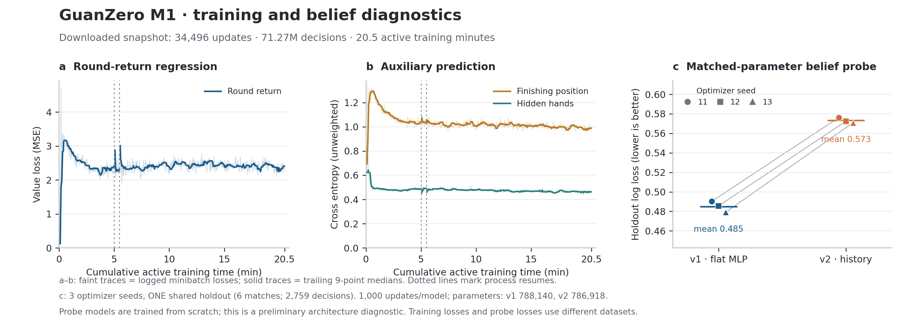

# M1 RunPod validation and pilot

Status: **complete**, September 21, 2026. Training, evaluation, verified artifact
download and provider-confirmed pod deletion are finished.

The user authorized using an existing local RunPod credential to obtain a node,
test the pipeline, and continue if the results support it. After the inherited
environment key returned HTTP 401, the user explicitly authorized the separate
credential source. No credential values are written to the repository or logs.

## Run limits and initial state

- Authorized cap: **$5 and two hours**, including setup and validation.
- Download results and checkpoints, then delete this run's pod.
- Account inspection succeeded: sufficient existing balance, no running or
  stopped pods, no current hourly spend. No top-up or payment change is needed.
- RTX 4090 Secure Cloud had no live availability. Allocated one RTX 5090 in
  EU-RO-1: 32 GB VRAM, 16 vCPUs, 60 GB RAM, 30 GB container disk and 10 GB
  pod volume. GPU quote/allocation: $0.99/hour; conservative total estimate
  including storage: $0.995952/hour.
- Pod ID: `kuf3qpi59kj0ew`; created **2026-09-21 23:12:25 UTC**. The local
  deletion guard reserves cleanup before a 1.8-hour deadline, inside the
  authorized two-hour maximum. No other account resources are touched.
- Official runtime image: `runpod/pytorch:1.2.0-cu1281-torch291-ubuntu2204`.
- All provider operations must target this experiment's recorded pod ID.

## Progress

| Step | Status | Evidence |
|---|---|---|
| Locate and validate credential | complete | Authorized credential works; inherited environment key rejected |
| Inspect balance, existing resources and catalog | complete | No existing pods; current live quote obtained |
| Bounded provisioning and deletion guard | complete | Unique manifest ownership, rate checked after allocation, local guard active |
| GPU and SSH hardware check | complete | RTX 5090, 32,607 MiB, NVIDIA driver 580.159.04 |
| Source-only upload | complete | Explicit export authorization received; 80 build/test source files, no credentials, datasets or previous artifacts |
| CUDA model/learner smoke and resume | complete | Python 3.12.13, Torch 2.9.1+cu128, CUDA 12.8, bf16; updates 2 then 4 after resume |
| Production configuration throughput/memory | complete | Five-minute 4,096-environment run: 9,024 updates, 18.77M decisions; finite losses |
| GPU interruption/recovery | complete | SIGTERM saved update 9,792 in about 1.2 seconds; continuation reports resumes=2 |
| Bounded continuation and fixed-seed evaluation | complete | 34,496 updates, 71.27M decisions; final beats five-minute checkpoint directly |
| Download artifacts and confirm pod deletion | complete | 1,787 evidence files and five selected checkpoints, SHA-256 verified; pod gone, account has zero pods/hourly spend |

## Local fixes before provisioning

Review reproduced a mixed-precision near-best sampling bug: float32 random
priorities were reduced into a bf16 tensor. The destination now matches the
priority dtype; fp16, bf16 and fp32 tests cover it. Stage A already converted
Q values to fp32, so the existing CPU pipeline was unaffected.

Metrics now include the candidate-count surge, process peak RSS, CUDA current
and peak allocated/reserved memory, and elapsed time updated each reporting
phase. These measurements will replace assumptions about the rented workload.

## GPU preflight evidence

- Source bundle SHA-256: `3b10dbcfb379a9a68e494cf0cea405ab174e4b3c5122d3a114b684e7aea5a383`.
- Extraction needed `tar --no-same-owner` because the pod volume does not permit
  restoring macOS ownership IDs. Contents and permissions were preserved.
- Built the C++ engine on Linux: 54 C++ cases passed; 81 focused Python
  training/environment/evaluation/watchdog tests passed.
- Full v1 model with 256 environments: real bf16 updates, 65,536 cumulative
  decisions, 256 completed rounds, and successful optimizer/checkpoint resume.
  Preflight peak CUDA allocation was about 108 MiB; this is not the production
  workload memory estimate.
- The node's scoped API key is injected into the container entry process, not
  the SSH session. A backup guard using that key was denied REST API access
  (HTTP 403) and exited. The account credential was not uploaded. The local
  account-authorized deletion guard and its keep-awake process were verified
  alive before the supervised production pilot began at 23:25 UTC.
- The scoped key can read its own pod through GraphQL. Mutation permission has
  not been verified. Automatic approval review rejected scheduling a second
  timed deletion because it could run before artifacts were retrieved; no
  second guard was installed. Results are downloaded before normal cleanup.

## Production pilot

At 199 seconds: 6,016 optimizer updates, 12,582,912 environment decisions,
216,693 completed rounds, 17,440 matches, 8,446,135 completed learner samples,
and 12,320,768 sampled training rows (replay reuses samples). Losses were finite.
Throughput was approximately 63,200 decisions/second. Peak host RSS was
4,306 MiB; CUDA peak allocation/reservation was 666/710 MiB. The largest batch
contained 803,808 candidates. Collection dominates the measured phase time.

The immutable untrained checkpoint scored -3.0 net levels/round on 100 duplicate
deals and won 0/20 full matches against local greedy. This is the baseline for
the exact same fixed-seed, FP32 CPU, deterministic-argmax evaluation after training.

The five-minute checkpoint completed 9,024 updates, 18,767,872 decisions,
324,987 rounds, 27,136 matches, 12,838,272 completed learner samples and
18,481,152 sampled training rows. On the same 100 duplicate deals it scored
**+1.055 net levels/round (paired bootstrap 95% CI [0.810, 1.295])**, and won
**19/20 matches (Wilson 95% CI [76.4%, 99.1%])**. It passed six of eight
behavior cases, including the unchanged heuristic tribute case; high-card
defense and bomb conservation failed.

Real GPU recovery: resumed the five-minute checkpoint, sent SIGTERM after
30 seconds, and observed a successful final checkpoint at update 9,792 about
1.2 seconds after the signal. A second resume began a bounded 900-second
continuation. Partial environment trajectories/replay restart by design;
optimizer state, learner RNGs, schedules and counters are restored.

The full continuation finished successfully at **34,496 updates**, with
**71,266,304 decisions, 1,264,800 rounds, 109,563 matches, 55,052,332 completed
learner samples and 70,647,808 sampled training rows**. Cumulative active
training time was 1,228.77 seconds (20.48 minutes), including the interruption
check. Training remained finite; the final optimizer and RNG state are saved.

The larger held-out validation uses a fresh seed (`20261001`) with 1,000
duplicate deals and 100 independent matches. Both checkpoints use the same
seed; the results confirm continued improvement:

| Checkpoint vs greedy | Net levels/round, 95% CI | Full-match wins, Wilson 95% CI |
|---|---|---|
| Five minutes | +1.1005 [1.0250, 1.1785] | 96/100 [90.2%, 98.4%] |
| Final | +1.4905 [1.4110, 1.5610] | 100/100 [96.3%, 100%] |

The paired improvement on the same 1,000 deals is **+0.3900 [0.2905, 0.4880]**
(10,000 bootstrap resamples, seed 20261002). Direct final-versus-five-minute
play over 500 duplicate deals yields **+0.608 [0.508, 0.719] net levels/round**.
This direct comparison confirms improvement beyond saturating the greedy bot.
The two defensive/bomb-conservation probe failures remain in the final model.

Independent frozen final-policy collection completed 200 fresh rounds with
seed 20260922 and no learner updates. The match holdout evaluates 39 rounds,
five matches and 1,958 decisions: hidden-hand log loss **0.44381**. This is a
deployed-head measurement, separate from the architecture probe below.

## Exploratory belief experiment

Frozen the first 317 completed training-log rounds before the first resume.
The deterministic match split contains 25 training matches / 10,192 decisions
and six held-out matches / 2,759 decisions. Both fresh supervised models use
1,000 optimizer steps, batch size 64 and identical sampled examples per seed.
Parameter counts are 788,140 (flat) and 786,918 (history), within 0.16%.

| Optimizer seed | Flat holdout log loss | History holdout log loss |
|---|---:|---:|
| 11 | 0.49020 | 0.57633 |
| 12 | 0.48564 | 0.57250 |
| 13 | 0.47902 | 0.57089 |

Lower is better. History loses on all three seeds under this small experiment;
there is no evidence here to enable v2 RL. The seeds share one holdout and
measure optimizer variation, not three independent datasets. This trains new
supervised models, separate from measuring the deployed checkpoint's hidden
head on fresh games. The three runs took about 35 seconds total while sharing
the node with continued RL; this is not an isolated throughput comparison.

A separate 128-update profiling run confirmed repeated NumPy copies and
`pin_memory()` allocation as worthwhile targets for a later throughput
experiment. It used the same architecture while sharing the node, so its
timings are diagnostic; this pilot did not change collection semantics or
claim an optimization speedup.

## Regression and artifact checks

- Final local suite: **255 tests passed** (`pytest -q tests oracle`).
- Downloaded preflight, five-minute, SIGTERM and final checkpoints load
  successfully on the local CPU with expected counters and optimizer states.
  All final model tensors are finite.
- The 1,787-file results archive and five selected checkpoint files match the
  SHA-256 hashes computed on the node. Initialization, five-minute, SIGTERM,
  final and CUDA-preflight checkpoints are retained; unevaluated periodic
  snapshots and the separate profiling run's weights are not retained.
- Artifacts: `.work/runpod/artifacts/`; resumable final checkpoint:
  `.work/runpod/artifacts/pilot/final.pt` (also copied to `latest.pt`).
  This directory is intentionally Git-ignored and must be copied separately
  when moving to another machine.
- Compact metrics, evaluation intervals and artifact checksums are preserved
  in [`M1-runpod-summary.json`](M1-runpod-summary.json). Source archive hash
  and runtime versions identify the tested implementation.

## Resource cleanup and cost

Deletion was confirmed at **2026-09-21 23:48:44 UTC**, 36.31 minutes after
creation. A separate account readback found **zero pods and $0/hour current
spend**. The conservative quote-based total is **$0.603**; the observed account
balance decrease at readback was **$0.575** (billing may settle later). Both are
well inside the approved $5/two-hour cap. Local guard/keep-awake processes were
cleaned up after provider deletion. No account credential was uploaded.

## Next training decision

The first-run engineering gate is complete. Continue from the final v1
checkpoint for a larger Stage A experiment, retaining it and the five-minute
checkpoint as fixed opponents. Greedy alone now saturates; keep direct
checkpoint comparisons and the two failed behavior cases visible. The small
belief experiment does not justify v2 RL. Published opponents remain
unavailable, so the external M1 gate and later M2/M3 gates are not marked met.
No additional rental or long run is started by this report.

## Evidence boundaries

The first pilot can validate engineering and report an initial learning trend.
It cannot establish the original M1 published-baseline gate, because those
agents remain unavailable. Any small arena run is internal smoke evidence.
