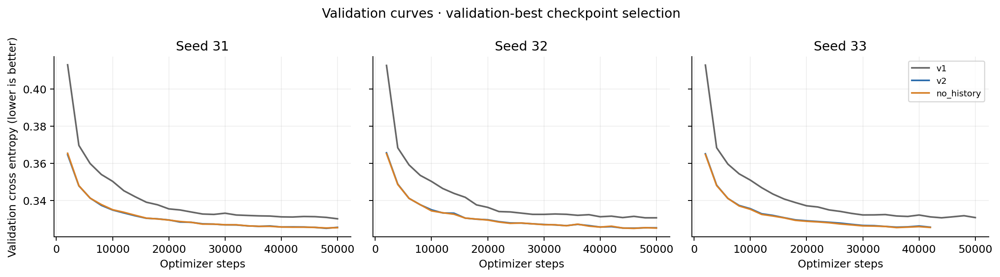
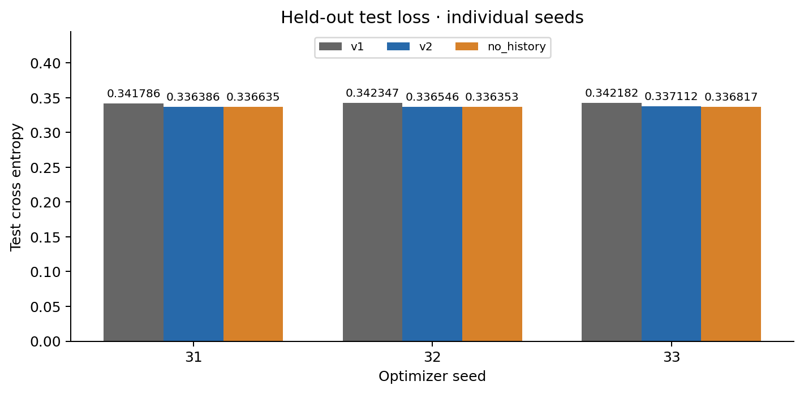
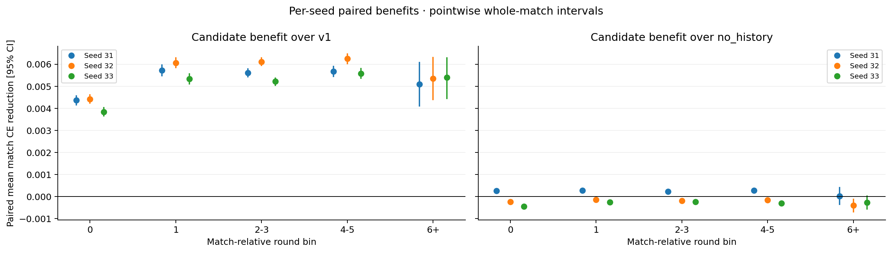

# M2-belief-corrected

Status: complete supervised evaluation. Runtime, billing, artifact/checkpoint verification and pod cleanup are reported separately.

History benefit over no_history: all three seed means positive = False; positive per-seed 95% interval in 1/3 seeds. Interpret the pooled estimate alongside this seed robustness.

Legacy combined gate: `v2_not_yet_justified`. This preserves the runner rule; descriptive evidence below is separate.

```json
{
  "history_over_no_history_pooled_ci_positive": false,
  "history_over_no_history_all_seed_means_positive": false
}
```

The collection uses the corrected trained M1 checkpoint (34,496 updates), not the earlier six-update smoke policy. Results from the two datasets must not be merged.

| Seed | Model | Test CE | Selected step | Steps run | Stop |
|---|---|---:|---:|---:|---|
| 31 | v1 | 0.341786 | 50000 | 50000 | step_cap |
| 31 | v2 | 0.336386 | 48000 | 50000 | step_cap |
| 31 | no_history | 0.336635 | 48000 | 50000 | step_cap |
| 32 | v1 | 0.342347 | 48000 | 50000 | step_cap |
| 32 | v2 | 0.336546 | 46000 | 50000 | step_cap |
| 32 | no_history | 0.336353 | 46000 | 50000 | step_cap |
| 33 | v1 | 0.342182 | 44000 | 50000 | step_cap |
| 33 | v2 | 0.337112 | 36000 | 42000 | plateau |
| 33 | no_history | 0.336817 | 36000 | 42000 | plateau |

7/9 fits reached the configured 50,000-step cap. Reaching a cap does not establish convergence; selected weights are validation-best.

Positive paired improvement favors the candidate. CIs estimate the equal-weight mean over matches after averaging three seed differences within each match. They are not CIs for micro CE differences, and seeds are not independent matches. These intervals condition on the three fitted seeds; seed variability remains visible in CSV/JSON. Cell intervals are pointwise, not multiplicity-adjusted.

| Reference | Cell | Candidate micro CE | Paired improvement [95% CI] | Matches | Decisions/targets |
|---|---|---:|---|---:|---:|
| v1 | overall | 0.336681 | +0.005426 [+0.005356, +0.005498] | 2757 | 590851 |
| v1 | round_bin:0 | 0.334926 | +0.004208 [+0.004082, +0.004337] | 2757 | 110198 |
| v1 | round_bin:1 | 0.336310 | +0.005708 [+0.005544, +0.005874] | 2748 | 109848 |
| v1 | round_bin:2-3 | 0.338095 | +0.005648 [+0.005525, +0.005758] | 2746 | 219343 |
| v1 | round_bin:4-5 | 0.336197 | +0.005836 [+0.005678, +0.005992] | 2729 | 143547 |
| v1 | round_bin:6+ | 0.335890 | +0.005282 [+0.004584, +0.005997] | 150 | 7915 |
| v1 | stage:early | 0.626437 | +0.007060 [+0.006963, +0.007161] | 2757 | 148733 |
| v1 | stage:early / target_relation:opponent | 0.633333 | +0.007399 [+0.007279, +0.007522] | 2757 | 297466 |
| v1 | stage:early / target_relation:teammate | 0.612647 | +0.006380 [+0.006228, +0.006528] | 2757 | 148733 |
| v1 | stage:early / target_seat:lho | 0.641984 | +0.007899 [+0.007754, +0.008049] | 2757 | 148733 |
| v1 | stage:early / target_seat:partner | 0.612647 | +0.006380 [+0.006228, +0.006528] | 2757 | 148733 |
| v1 | stage:early / target_seat:rho | 0.624681 | +0.006899 [+0.006757, +0.007039] | 2757 | 148733 |
| v1 | stage:late | 0.120466 | +0.002493 [+0.002411, +0.002579] | 2757 | 201522 |
| v1 | stage:late / target_relation:opponent | 0.140834 | +0.003207 [+0.003091, +0.003327] | 2757 | 403044 |
| v1 | stage:late / target_relation:teammate | 0.079732 | +0.001066 [+0.000985, +0.001141] | 2757 | 201522 |
| v1 | stage:late / target_seat:lho | 0.141066 | +0.003235 [+0.003096, +0.003375] | 2757 | 201522 |
| v1 | stage:late / target_seat:partner | 0.079732 | +0.001066 [+0.000985, +0.001141] | 2757 | 201522 |
| v1 | stage:late / target_seat:rho | 0.140601 | +0.003179 [+0.003035, +0.003324] | 2757 | 201522 |
| v1 | stage:middle | 0.338659 | +0.006865 [+0.006769, +0.006966] | 2757 | 240596 |
| v1 | stage:middle / target_relation:opponent | 0.354853 | +0.007582 [+0.007462, +0.007704] | 2757 | 481192 |
| v1 | stage:middle / target_relation:teammate | 0.306270 | +0.005429 [+0.005297, +0.005570] | 2757 | 240596 |
| v1 | stage:middle / target_seat:lho | 0.358753 | +0.007965 [+0.007822, +0.008115] | 2757 | 240596 |
| v1 | stage:middle / target_seat:partner | 0.306270 | +0.005429 [+0.005297, +0.005570] | 2757 | 240596 |
| v1 | stage:middle / target_seat:rho | 0.350953 | +0.007199 [+0.007056, +0.007342] | 2757 | 240596 |
| v1 | style_region:heldout | 0.336681 | +0.005426 [+0.005357, +0.005499] | 2757 | 590851 |
| v1 | target_driver:bot | 0.364242 | +0.006761 [+0.006648, +0.006877] | 2757 | 914696 |
| v1 | target_driver:policy | 0.307295 | +0.003996 [+0.003913, +0.004075] | 2757 | 857857 |
| v1 | target_relation:opponent | 0.351958 | +0.006050 [+0.005962, +0.006144] | 2757 | 1181702 |
| v1 | target_relation:teammate | 0.306128 | +0.004179 [+0.004094, +0.004268] | 2757 | 590851 |
| v1 | target_seat:lho | 0.355803 | +0.006338 [+0.006234, +0.006445] | 2757 | 590851 |
| v1 | target_seat:partner | 0.306128 | +0.004179 [+0.004094, +0.004268] | 2757 | 590851 |
| v1 | target_seat:rho | 0.348113 | +0.005763 [+0.005653, +0.005877] | 2757 | 590851 |
| no_history | overall | 0.336681 | -0.000081 [-0.000100, -0.000061] | 2757 | 590851 |
| no_history | round_bin:0 | 0.334926 | -0.000142 [-0.000176, -0.000106] | 2757 | 110198 |
| no_history | round_bin:1 | 0.336310 | -0.000046 [-0.000091, -0.000004] | 2748 | 109848 |
| no_history | round_bin:2-3 | 0.338095 | -0.000069 [-0.000103, -0.000036] | 2746 | 219343 |
| no_history | round_bin:4-5 | 0.336197 | -0.000059 [-0.000101, -0.000015] | 2729 | 143547 |
| no_history | round_bin:6+ | 0.335890 | -0.000219 [-0.000399, -0.000042] | 150 | 7915 |
| no_history | stage:early | 0.626437 | -0.000125 [-0.000150, -0.000100] | 2757 | 148733 |
| no_history | stage:early / target_relation:opponent | 0.633333 | -0.000189 [-0.000220, -0.000158] | 2757 | 297466 |
| no_history | stage:early / target_relation:teammate | 0.612647 | +0.000004 [-0.000037, +0.000044] | 2757 | 148733 |
| no_history | stage:early / target_seat:lho | 0.641984 | -0.000009 [-0.000051, +0.000034] | 2757 | 148733 |
| no_history | stage:early / target_seat:partner | 0.612647 | +0.000004 [-0.000037, +0.000044] | 2757 | 148733 |
| no_history | stage:early / target_seat:rho | 0.624681 | -0.000370 [-0.000411, -0.000331] | 2757 | 148733 |
| no_history | stage:late | 0.120466 | -0.000073 [-0.000103, -0.000045] | 2757 | 201522 |
| no_history | stage:late / target_relation:opponent | 0.140834 | -0.000079 [-0.000119, -0.000039] | 2757 | 403044 |
| no_history | stage:late / target_relation:teammate | 0.079732 | -0.000062 [-0.000091, -0.000033] | 2757 | 201522 |
| no_history | stage:late / target_seat:lho | 0.141066 | -0.000044 [-0.000095, +0.000007] | 2757 | 201522 |
| no_history | stage:late / target_seat:partner | 0.079732 | -0.000062 [-0.000091, -0.000033] | 2757 | 201522 |
| no_history | stage:late / target_seat:rho | 0.140601 | -0.000114 [-0.000168, -0.000061] | 2757 | 201522 |
| no_history | stage:middle | 0.338659 | -0.000061 [-0.000086, -0.000035] | 2757 | 240596 |
| no_history | stage:middle / target_relation:opponent | 0.354853 | -0.000047 [-0.000083, -0.000014] | 2757 | 481192 |
| no_history | stage:middle / target_relation:teammate | 0.306270 | -0.000088 [-0.000130, -0.000045] | 2757 | 240596 |
| no_history | stage:middle / target_seat:lho | 0.358753 | +0.000023 [-0.000024, +0.000070] | 2757 | 240596 |
| no_history | stage:middle / target_seat:partner | 0.306270 | -0.000088 [-0.000130, -0.000045] | 2757 | 240596 |
| no_history | stage:middle / target_seat:rho | 0.350953 | -0.000118 [-0.000165, -0.000073] | 2757 | 240596 |
| no_history | style_region:heldout | 0.336681 | -0.000081 [-0.000099, -0.000062] | 2757 | 590851 |
| no_history | target_driver:bot | 0.364242 | -0.000097 [-0.000129, -0.000064] | 2757 | 914696 |
| no_history | target_driver:policy | 0.307295 | -0.000063 [-0.000086, -0.000041] | 2757 | 857857 |
| no_history | target_relation:opponent | 0.351958 | -0.000093 [-0.000119, -0.000068] | 2757 | 1181702 |
| no_history | target_relation:teammate | 0.306128 | -0.000056 [-0.000082, -0.000030] | 2757 | 590851 |
| no_history | target_seat:lho | 0.355803 | -0.000007 [-0.000040, +0.000026] | 2757 | 590851 |
| no_history | target_seat:partner | 0.306128 | -0.000056 [-0.000082, -0.000030] | 2757 | 590851 |
| no_history | target_seat:rho | 0.348113 | -0.000179 [-0.000214, -0.000145] | 2757 | 590851 |

Round-bin differences are descriptive: this model sees only current-round public history, with no cross-round carried state. Later-round improvement cannot prove cross-round opponent learning.

All splits are whole-match; the test is heldout-style only. The test includes retained decisions after the configured per-round cap, not all original collection decisions.

Checkpoint identity: `8a8e2b08dec2e73998092a67cbc25c26df75b4c0d2f02fd0a791d5d16cd4f745`. Dataset fingerprint: `2cafc28641f61b570fed7abf4600bd00ba584b6967d6d46bbb538c01dd730aee`.

[Per-seed and pooled cells CSV](M2-belief-corrected-cells.csv) · [Summary JSON](M2-belief-corrected-summary.json)


## Post-hoc quota-tail sensitivity

Conservatively exclude each environment last RECORDED match. These groups are possibly quota-truncated, not proven incomplete. No retraining or new evaluation; primary protocol and gates unchanged.

Excluded 35 of 2757 test matches; 2722 remain.

| Reference | Seeds | Paired mean improvement [95% CI] | Matches |
|---|---|---|---:|
| v1 | pooled | +0.005441 [+0.005369, +0.005512] | 2722 |
| v1 | 31 | +0.005413 [+0.005310, +0.005516] | 2722 |
| v1 | 32 | +0.005824 [+0.005723, +0.005922] | 2722 |
| v1 | 33 | +0.005086 [+0.004988, +0.005183] | 2722 |
| no_history | pooled | -0.000079 [-0.000099, -0.000060] | 2722 |
| no_history | 31 | +0.000253 [+0.000216, +0.000289] | 2722 |
| no_history | 32 | -0.000191 [-0.000225, -0.000157] | 2722 |
| no_history | 33 | -0.000300 [-0.000330, -0.000268] | 2722 |






