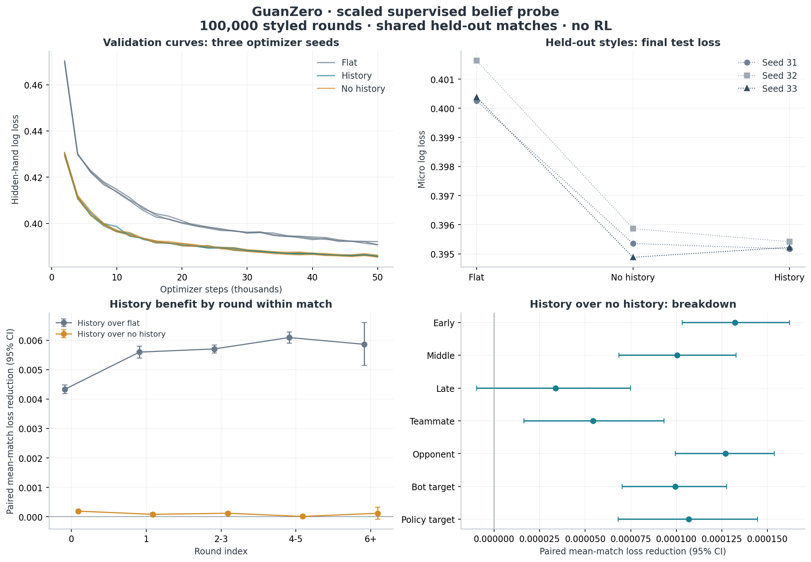

# Scaled styled-opponent belief probe

Status: **complete**. Nine supervised fits, held-out evaluation, verified local artifact download and provider-confirmed pod deletion are finished. No RL updates or policy promotion.

## Decision

History does not establish a consistent positive advantage over no_history on held-out styles. Following the requested decision rule, use no_history for the next Stage B experiment and evaluate cross-round memory separately.

Runner gate after combining seeds: `v2_not_yet_justified`. The three one-seed report gates are not used as the combined gate.

**Budget boundary:** 9/9 fits reached the 50,000-step cap. These runs must not be described as converged solely because training ended. Checkpoint selection uses validation loss only.

## Results

Test loss is micro-averaged hidden-card-count cross entropy (lower is better).

| Seed | Model | Test loss | Best validation loss | Selected step | Steps run | Stop |
|---|---|---:|---:|---:|---:|---|
| 31 | flat | 0.400258 | 0.390726 | 50,000 | 50,000 | step_cap |
| 31 | no_history | 0.395355 | 0.385889 | 50,000 | 50,000 | step_cap |
| 31 | history | 0.395170 | 0.385733 | 50,000 | 50,000 | step_cap |
| 32 | flat | 0.401639 | 0.392096 | 50,000 | 50,000 | step_cap |
| 32 | no_history | 0.395868 | 0.386228 | 50,000 | 50,000 | step_cap |
| 32 | history | 0.395415 | 0.385854 | 50,000 | 50,000 | step_cap |
| 33 | flat | 0.400382 | 0.390764 | 50,000 | 50,000 | step_cap |
| 33 | no_history | 0.394882 | 0.385306 | 50,000 | 50,000 | step_cap |
| 33 | history | 0.395224 | 0.385633 | 50,000 | 50,000 | step_cap |

Positive paired improvements mean history has lower loss. Intervals below are for the **equal-weight mean over matches**, after averaging the paired difference across seeds within each match. They are not intervals for the micro loss difference. Seeds share the test set and are not counted as independent matches.

| Comparison | Reference micro loss | History micro loss | Paired improvement [95% CI] | Matches |
|---|---:|---:|---|---:|
| History over flat | 0.400759 | 0.395270 | +0.005515 [+0.005432, +0.005598] | 2,768 |
| History over no_history | 0.395368 | 0.395270 | +0.000103 [+0.000079, +0.000126] | 2,768 |

Across seeds, no_history reduces mean micro loss by **1.345%** versus flat. Adding history reduces it by only **0.0249%** on average, with two seed wins and one loss. The positive pooled interval is conditional on these three fitted models; it does not establish robustness to the training seed.

| Seed | History over flat [95% CI] | History over no_history [95% CI] |
|---|---|---|
| 31 | +0.005110 [+0.005010, +0.005212] | +0.000187 [+0.000143, +0.000230] |
| 32 | +0.006250 [+0.006148, +0.006354] | +0.000464 [+0.000423, +0.000505] |
| 33 | +0.005185 [+0.005085, +0.005286] | -0.000343 [-0.000387, -0.000299] |

## Paired test breakdown

Every row has the same paired match resamples for the two comparator contrasts. Overall intervals use 10,000 resamples; cell intervals use 2,000. Stage cells average all three target seats; relation, seat and driver cells average the relevant target seats.

| Cell | Matches | History micro loss | History over flat [95% CI] | History over no_history [95% CI] |
|---|---:|---:|---|---|
| round_bin:0 | 2,768 | 0.395822 | +0.004330 [+0.004181, +0.004483] | +0.000192 [+0.000147, +0.000237] |
| round_bin:1 | 2,761 | 0.398682 | +0.005598 [+0.005392, +0.005799] | +0.000084 [+0.000028, +0.000138] |
| round_bin:2-3 | 2,757 | 0.392323 | +0.005706 [+0.005568, +0.005842] | +0.000121 [+0.000080, +0.000161] |
| round_bin:4-5 | 2,741 | 0.396978 | +0.006093 [+0.005905, +0.006284] | +0.000012 [-0.000043, +0.000065] |
| round_bin:6+ | 194 | 0.391067 | +0.005864 [+0.005146, +0.006605] | +0.000120 [-0.000080, +0.000328] |
| stage:early | 2,768 | 0.634944 | +0.006506 [+0.006398, +0.006614] | +0.000132 [+0.000103, +0.000162] |
| stage:early / target_relation:opponent | 2,768 | 0.638564 | +0.007193 [+0.007070, +0.007315] | +0.000184 [+0.000149, +0.000220] |
| stage:early / target_relation:teammate | 2,768 | 0.627704 | +0.005132 [+0.004978, +0.005290] | +0.000028 [-0.000020, +0.000076] |
| stage:early / target_seat:lho | 2,768 | 0.642244 | +0.006928 [+0.006775, +0.007072] | +0.000140 [+0.000093, +0.000187] |
| stage:early / target_seat:partner | 2,768 | 0.627704 | +0.005132 [+0.004978, +0.005290] | +0.000028 [-0.000020, +0.000076] |
| stage:early / target_seat:rho | 2,768 | 0.634885 | +0.007458 [+0.007316, +0.007595] | +0.000228 [+0.000183, +0.000273] |
| stage:late | 2,767 | 0.099855 | +0.001679 [+0.001567, +0.001792] | +0.000034 [-0.000010, +0.000075] |
| stage:late / target_relation:opponent | 2,767 | 0.112272 | +0.002097 [+0.001962, +0.002229] | +0.000059 [+0.000009, +0.000108] |
| stage:late / target_relation:teammate | 2,767 | 0.075022 | +0.000844 [+0.000688, +0.000996] | -0.000016 [-0.000081, +0.000049] |
| stage:late / target_seat:lho | 2,767 | 0.113170 | +0.001889 [+0.001733, +0.002041] | +0.000063 [-0.000005, +0.000129] |
| stage:late / target_seat:partner | 2,767 | 0.075022 | +0.000844 [+0.000688, +0.000996] | -0.000016 [-0.000081, +0.000049] |
| stage:late / target_seat:rho | 2,767 | 0.111374 | +0.002304 [+0.002142, +0.002463] | +0.000054 [-0.000011, +0.000118] |
| stage:middle | 2,768 | 0.319055 | +0.005897 [+0.005794, +0.006001] | +0.000100 [+0.000068, +0.000133] |
| stage:middle / target_relation:opponent | 2,768 | 0.329591 | +0.006413 [+0.006298, +0.006529] | +0.000108 [+0.000072, +0.000144] |
| stage:middle / target_relation:teammate | 2,768 | 0.297982 | +0.004865 [+0.004724, +0.005006] | +0.000086 [+0.000037, +0.000136] |
| stage:middle / target_seat:lho | 2,768 | 0.332395 | +0.006088 [+0.005956, +0.006226] | +0.000119 [+0.000072, +0.000168] |
| stage:middle / target_seat:partner | 2,768 | 0.297982 | +0.004865 [+0.004724, +0.005006] | +0.000086 [+0.000037, +0.000136] |
| stage:middle / target_seat:rho | 2,768 | 0.326787 | +0.006738 [+0.006603, +0.006874] | +0.000096 [+0.000046, +0.000144] |
| style_region:heldout | 2,768 | 0.395270 | +0.005515 [+0.005432, +0.005597] | +0.000103 [+0.000078, +0.000127] |
| target_driver:bot | 2,768 | 0.335027 | +0.004834 [+0.004736, +0.004926] | +0.000099 [+0.000070, +0.000128] |
| target_driver:policy | 2,768 | 0.462636 | +0.006272 [+0.006150, +0.006406] | +0.000107 [+0.000068, +0.000145] |
| target_relation:opponent | 2,768 | 0.403728 | +0.006072 [+0.005978, +0.006170] | +0.000127 [+0.000100, +0.000154] |
| target_relation:teammate | 2,768 | 0.378353 | +0.004402 [+0.004289, +0.004517] | +0.000054 [+0.000016, +0.000093] |
| target_seat:lho | 2,768 | 0.406562 | +0.005785 [+0.005674, +0.005896] | +0.000121 [+0.000084, +0.000156] |
| target_seat:partner | 2,768 | 0.378353 | +0.004402 [+0.004289, +0.004517] | +0.000054 [+0.000016, +0.000093] |
| target_seat:rho | 2,768 | 0.400895 | +0.006359 [+0.006247, +0.006471] | +0.000133 [+0.000097, +0.000169] |

Per-seed cell intervals: [CSV](M2-belief-scaled-cells.csv). Full compact results: [JSON](M2-belief-scaled-summary.json). Original per-match tables remain in the verified local artifact.

## Round-index interpretation

The history-specific benefit does not consistently increase with round index. The larger late-round advantage over flat is also explained by the no_history structural control, so it is not evidence for history-driven adaptation.

The model sees only current-round public tokens; it has no state carried between rounds. A larger history advantage in later rounds can motivate v3, but cannot demonstrate cross-round opponent learning. State distributions and which matches reach late rounds are possible explanations. A separate memory-enabled versus memory-masked experiment remains necessary.

The following exploratory contrast is the history advantage in round 6+ minus round 0, restricted to the **same matches present in both bins**, for the no_history comparator. It is distinct from comparing two independently composed bin means.

| Seed | Same matches | Change in history advantage | 95% CI |
|---|---:|---:|---|
| 31 | 194 | +0.000252 | [-0.000240, +0.000759] |
| 32 | 194 | -0.000289 | [-0.000732, +0.000165] |
| 33 | 194 | -0.000563 | [-0.001017, -0.000120] |

## Protocol and data

- Frozen-policy collection: 100,000 rounds, 10,145,726 original decisions, 18,457 match groups; zero learner updates during collection.
- Seeds 31, 32, 33. All three use identical whole-match splits, data subsampling and validation samples.
- History/no_history: four public-stream layers, width 256; 4,662,246 parameters each. Flat: four MLP layers with width chosen to match capacity, 4,660,178 parameters (not fixed at width 256).
- Only hidden-hand count CE is optimized. Adam 0.0003, batch 64, maximum 50,000 steps, validation every 2,000, patience 3, minimum 10,000 steps.
- Follow the supplied command: cap at 40 decisions per round, retain all rounds and exact public-history prefixes. There is no round-count subsampling cap. The test uses all retained decisions in its selected matches, not every original decision.
- Validation cap 100,000 decisions. Test matches come exclusively from bomb_threshold >= 0.75 and follow_aggression >= 0.75. All held-out-region matches are excluded from training; unused held-out matches are discarded.
- Style, round index and driver metadata do not enter model inputs.

| Split | Matches | Rounds | Retained decisions | Evaluated/trained decisions |
|---|---:|---:|---:|---:|
| train | 11,942 | 64,746 | 2,589,840 | 2,589,840 |
| validation | 2,768 | 15,030 | 601,199 | 100,000 |
| test | 2,768 | 14,929 | 597,160 | 597,160 |

Each process loaded 3,999,999 retained decisions, with 10,516,805,475 array bytes. Dataset fingerprint: `7f048aaba8a15d26c15fcc27504ea67bd05d773375b9ffe6b3a93062e3132d56`.

## Engineering verification

- Filled missing stage/relation/relative-seat cells so every requested cell receives a paired whole-match interval.
- Best checkpoints are atomically saved after every validation improvement, before test evaluation. Interruption tests verify best weights survive validation/test failure.
- Final target-node focused suite: 38 tests passed. Short CUDA training/inference smoke was finite for all three models. Source hash verification covered 85 uploaded files.
- Runtime: RTX 5090 (32 GB VRAM), 21 allocated vCPUs, 125 GB allocated host RAM; PyTorch 2.9.1+cu128 / CUDA 12.8. Image `runpod/pytorch:1.2.0-cu1281-torch291-ubuntu2204`.
- Data extracted to local container disk to avoid network-volume overhead for 100,000 small files. Results and best checkpoints periodically downloaded to the Mac. Credentials were not uploaded.
- Final results archive: SHA-256 `e8322c01f7f9f694b1b908f2352081f2c1070f4cf1708bf8098c5e28ccf79e85`, 167,972,245 bytes; verified before deleting the pod.

All nine downloaded checkpoints were loaded locally and verified against their reported SHA-256, architecture, seed, selected step and dataset identity; all tensors are finite and parameter counts match. Verification receipt: `.work/runpod-belief/checkpoints-verified.json`.

## Cost and cleanup

Pod `tneibh6kkcqkda` ran for 78.37 minutes. GPU rate $0.99/hour; conservative storage estimate $0.006697/hour. Quote-based total: **$1.302**. Observed account balance change: $1.280 (billing may settle later).

Provider-confirmed termination: 2026-09-22T05:23:23.513065+00:00. Account hourly spend at readback: $0/hour.

The $6 allowance and five-hour runtime limit were operational bounds backed by a local supervisor, not a provider-enforced TTL. Normal cleanup downloaded and verified the immutable results archive first.

Local artifacts: `.work/runpod-belief/artifacts/runs/belief/`; individual selected weights: `scaled-s<seed>/<model>-s<seed>.pt`. Full data and artifacts are Git-ignored and must be copied separately when moving machines.
