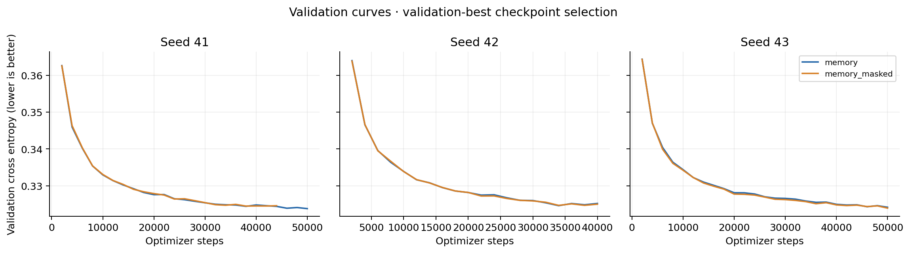
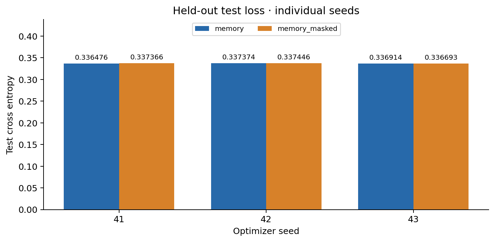
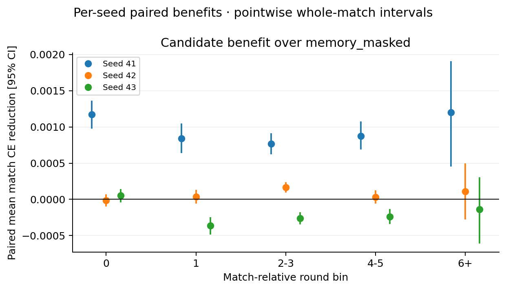

# M2-memory

Status: complete supervised evaluation. Runtime, billing, artifact/checkpoint verification and pod cleanup are reported separately.

Memory late benefit: all three seed means positive = False; positive per-seed 95% interval in 1/3 seeds. Adaptation and pooled evidence do not replace this seed robustness check.

Legacy combined gate: `v3_not_yet_justified`. This preserves the runner rule; descriptive evidence below is separate.

```json
{
  "paired_adaptation_pooled_ci_positive": false,
  "paired_late_benefit_pooled_ci_positive": true,
  "interpretation": "Positive adaptation is distinct from positive late benefit; a harmful memory can become less harmful. Raw control trends can reflect round difficulty. Failure to detect a control trend does not establish equivalence."
}
```

The collection uses the corrected trained M1 checkpoint (34,496 updates), not the earlier six-update smoke policy. Results from the two datasets must not be merged.

| Seed | Model | Test CE | Selected step | Steps run | Stop |
|---|---|---:|---:|---:|---|
| 41 | memory | 0.336476 | 50000 | 50000 | step_cap |
| 41 | memory_masked | 0.337366 | 38000 | 44000 | plateau |
| 42 | memory | 0.337374 | 34000 | 40000 | plateau |
| 42 | memory_masked | 0.337446 | 34000 | 40000 | plateau |
| 43 | memory | 0.336914 | 50000 | 50000 | step_cap |
| 43 | memory_masked | 0.336693 | 50000 | 50000 | step_cap |

3/6 fits reached the configured 50,000-step cap. Reaching a cap does not establish convergence; selected weights are validation-best.

Positive paired improvement favors the candidate. CIs estimate the equal-weight mean over matches after averaging three seed differences within each match. They are not CIs for micro CE differences, and seeds are not independent matches. These intervals condition on the three fitted seeds; seed variability remains visible in CSV/JSON. Cell intervals are pointwise, not multiplicity-adjusted.

| Reference | Cell | Candidate micro CE | Paired improvement [95% CI] | Matches | Decisions/targets |
|---|---|---:|---|---:|---:|
| memory_masked | overall | 0.336921 | +0.000253 [+0.000219, +0.000288] | 2757 | 295620 |
| memory_masked | adapt:early | 0.336967 | +0.000250 [+0.000215, +0.000284] | 2757 | 274420 |
| memory_masked | adapt:late | 0.336334 | +0.000207 [+0.000068, +0.000343] | 862 | 21200 |
| memory_masked | round_bin:0 | 0.334030 | +0.000404 [+0.000334, +0.000472] | 2757 | 55140 |
| memory_masked | round_bin:1 | 0.337643 | +0.000170 [+0.000088, +0.000254] | 2748 | 54960 |
| memory_masked | round_bin:2-3 | 0.337608 | +0.000223 [+0.000165, +0.000277] | 2746 | 109740 |
| memory_masked | round_bin:4-5 | 0.337714 | +0.000223 [+0.000151, +0.000303] | 2729 | 71820 |
| memory_masked | round_bin:6+ | 0.333747 | +0.000390 [+0.000075, +0.000721] | 150 | 3960 |
| memory_masked | round_index:0 | 0.334030 | +0.000404 [+0.000334, +0.000472] | 2757 | 55140 |
| memory_masked | round_index:1 | 0.337643 | +0.000170 [+0.000088, +0.000254] | 2748 | 54960 |
| memory_masked | round_index:2 | 0.337308 | +0.000210 [+0.000137, +0.000285] | 2746 | 54920 |
| memory_masked | round_index:3 | 0.337910 | +0.000237 [+0.000157, +0.000319] | 2741 | 54820 |
| memory_masked | round_index:4 | 0.337963 | +0.000220 [+0.000143, +0.000302] | 2729 | 54580 |
| memory_masked | round_index:5 | 0.336928 | +0.000185 [+0.000039, +0.000325] | 862 | 17240 |
| memory_masked | round_index:6 | 0.330726 | +0.000413 [+0.000068, +0.000767] | 150 | 3000 |
| memory_masked | round_index:7 | 0.350823 | +0.000494 [-0.000257, +0.001241] | 39 | 780 |
| memory_masked | round_index:8 | 0.306825 | +0.000462 [-0.000563, +0.001782] | 8 | 160 |
| memory_masked | round_index:9 | 0.336367 | +0.001201 [+0.001201, +0.001201] | 1 | 20 |
| memory_masked | stage:early | 0.626996 | +0.000333 [+0.000282, +0.000387] | 2757 | 74434 |
| memory_masked | stage:early / target_relation:opponent | 0.633589 | +0.000356 [+0.000296, +0.000421] | 2757 | 148868 |
| memory_masked | stage:early / target_relation:teammate | 0.613811 | +0.000286 [+0.000205, +0.000368] | 2757 | 74434 |
| memory_masked | stage:early / target_seat:lho | 0.642864 | +0.000233 [+0.000147, +0.000316] | 2757 | 74434 |
| memory_masked | stage:early / target_seat:partner | 0.613811 | +0.000286 [+0.000205, +0.000368] | 2757 | 74434 |
| memory_masked | stage:early / target_seat:rho | 0.624314 | +0.000479 [+0.000398, +0.000569] | 2757 | 74434 |
| memory_masked | stage:late | 0.120738 | +0.000210 [+0.000162, +0.000258] | 2757 | 101055 |
| memory_masked | stage:late / target_relation:opponent | 0.141053 | +0.000283 [+0.000220, +0.000347] | 2757 | 202110 |
| memory_masked | stage:late / target_relation:teammate | 0.080108 | +0.000064 [+0.000016, +0.000110] | 2757 | 101055 |
| memory_masked | stage:late / target_seat:lho | 0.141421 | +0.000228 [+0.000148, +0.000312] | 2757 | 101055 |
| memory_masked | stage:late / target_seat:partner | 0.080108 | +0.000064 [+0.000016, +0.000110] | 2757 | 101055 |
| memory_masked | stage:late / target_seat:rho | 0.140686 | +0.000337 [+0.000253, +0.000417] | 2757 | 101055 |
| memory_masked | stage:middle | 0.339044 | +0.000247 [+0.000196, +0.000294] | 2757 | 120131 |
| memory_masked | stage:middle / target_relation:opponent | 0.355295 | +0.000338 [+0.000279, +0.000399] | 2757 | 240262 |
| memory_masked | stage:middle / target_relation:teammate | 0.306541 | +0.000063 [-0.000016, +0.000138] | 2757 | 120131 |
| memory_masked | stage:middle / target_seat:lho | 0.359272 | +0.000252 [+0.000173, +0.000328] | 2757 | 120131 |
| memory_masked | stage:middle / target_seat:partner | 0.306541 | +0.000063 [-0.000016, +0.000138] | 2757 | 120131 |
| memory_masked | stage:middle / target_seat:rho | 0.351318 | +0.000424 [+0.000343, +0.000508] | 2757 | 120131 |
| memory_masked | style_region:heldout | 0.336921 | +0.000253 [+0.000219, +0.000287] | 2757 | 295620 |
| memory_masked | target_driver:bot | 0.364533 | +0.000183 [+0.000128, +0.000236] | 2757 | 457543 |
| memory_masked | target_driver:policy | 0.307495 | +0.000329 [+0.000287, +0.000373] | 2757 | 429317 |
| memory_masked | target_relation:opponent | 0.352130 | +0.000321 [+0.000278, +0.000364] | 2757 | 591240 |
| memory_masked | target_relation:teammate | 0.306504 | +0.000117 [+0.000066, +0.000163] | 2757 | 295620 |
| memory_masked | target_seat:lho | 0.356207 | +0.000233 [+0.000178, +0.000286] | 2757 | 295620 |
| memory_masked | target_seat:partner | 0.306504 | +0.000117 [+0.000066, +0.000163] | 2757 | 295620 |
| memory_masked | target_seat:rho | 0.348053 | +0.000410 [+0.000356, +0.000467] | 2757 | 295620 |

Task4 memory attends prior-round public summaries plus BOS; it does not additionally attend the current-round token sequence. Its separately trained masked control has no usable prior-round memory. Task3 tests current-round history separately; these contrasts must not be conflated.

Paired adaptation is late-minus-early memory benefit on the same matches. Its late-benefit CI is reported separately; a positive adaptation contrast alone is insufficient.

```json
{
  "available": true,
  "test_matches": 862,
  "mean_adaptation_improvement": 2.217178493437338e-05,
  "bootstrap_95_ci": [
    -0.0001297189977346063,
    0.00017293935902341296
  ],
  "mean_late_improvement": 0.00020701637004611858,
  "late_bootstrap_95_ci": [
    7.314251700742584e-05,
    0.0003385795038026207
  ],
  "mean_early_improvement": 0.00018484458511174522,
  "early_bootstrap_95_ci": [
    0.00012306468689892897,
    0.0002461312685149384
  ],
  "sampling_unit": "same matches present in early and late, after within-match seed averaging"
}
```

Late-cell rows above report actual evaluated match and retained-decision counts. Eight-round memory is an upper bound; short matches have fewer prior rounds. Style readout and raw self-adaptation diagnostics remain per seed in JSON. A memory benefit does not prove opponent-habit causality without a history-shuffle control; it does not prove playing strength without an arena comparison. No causal or arena result is claimed here.

All splits are whole-match; the test is heldout-style only. The test includes retained decisions after the configured per-round cap, not all original collection decisions.

Checkpoint identity: `8a8e2b08dec2e73998092a67cbc25c26df75b4c0d2f02fd0a791d5d16cd4f745`. Dataset fingerprint: `2cafc28641f61b570fed7abf4600bd00ba584b6967d6d46bbb538c01dd730aee`.

[Per-seed and pooled cells CSV](M2-memory-cells.csv) · [Summary JSON](M2-memory-summary.json)


## Post-hoc quota-tail sensitivity

Conservatively exclude each environment last RECORDED match. These groups are possibly quota-truncated, not proven incomplete. No retraining or new evaluation; primary protocol and gates unchanged.

Excluded 35 of 2757 test matches; 2722 remain.

| Reference | Seeds | Paired mean improvement [95% CI] | Matches |
|---|---|---|---:|
| memory_masked | pooled | +0.000252 [+0.000217, +0.000287] | 2722 |
| memory_masked | 41 | +0.000896 [+0.000809, +0.000981] | 2722 |
| memory_masked | 42 | +0.000078 [+0.000041, +0.000115] | 2722 |
| memory_masked | 43 | -0.000217 [-0.000262, -0.000173] | 2722 |

Memory sensitivity (same-match adaptation and actual late benefit are separate):

```json
{
  "same_matches": 860,
  "pooled": {
    "late_minus_early": {
      "available": true,
      "test_matches": 860,
      "mean_match_log_loss_improvement": 2.832419946250859e-05,
      "bootstrap_95_ci": [
        -0.00011772631393197028,
        0.00017634017010969866
      ]
    },
    "late_benefit": {
      "available": true,
      "test_matches": 860,
      "mean_match_log_loss_improvement": 0.00021061213460305694,
      "bootstrap_95_ci": [
        7.391537111677128e-05,
        0.0003460501663349501
      ]
    }
  },
  "per_seed": {
    "41": {
      "late_minus_early": {
        "available": true,
        "test_matches": 860,
        "mean_match_log_loss_improvement": 9.193119434468551e-05,
        "bootstrap_95_ci": [
          -0.00028013170842126363,
          0.00046052852946011207
        ]
      },
      "late_benefit": {
        "available": true,
        "test_matches": 860,
        "mean_match_log_loss_improvement": 0.0009173944948064339,
        "bootstrap_95_ci": [
          0.0005783797449797639,
          0.0012572646391670816
        ]
      }
    },
    "42": {
      "late_minus_early": {
        "available": true,
        "test_matches": 860,
        "mean_match_log_loss_improvement": 1.2801654746690338e-05,
        "bootstrap_95_ci": [
          -0.0001447889917878687,
          0.0001750590265985065
        ]
      },
      "late_benefit": {
        "available": true,
        "test_matches": 860,
        "mean_match_log_loss_improvement": 2.88729560845887e-05,
        "bootstrap_95_ci": [
          -0.00012031596992290468,
          0.00018395772773188083
        ]
      }
    },
    "43": {
      "late_minus_early": {
        "available": true,
        "test_matches": 860,
        "mean_match_log_loss_improvement": -1.9760250703850055e-05,
        "bootstrap_95_ci": [
          -0.0002060891690359046,
          0.0001676661814646804
        ]
      },
      "late_benefit": {
        "available": true,
        "test_matches": 860,
        "mean_match_log_loss_improvement": -0.0003144310470818518,
        "bootstrap_95_ci": [
          -0.00048201459395113877,
          -0.00014466999297850755
        ]
      }
    }
  }
}
```









