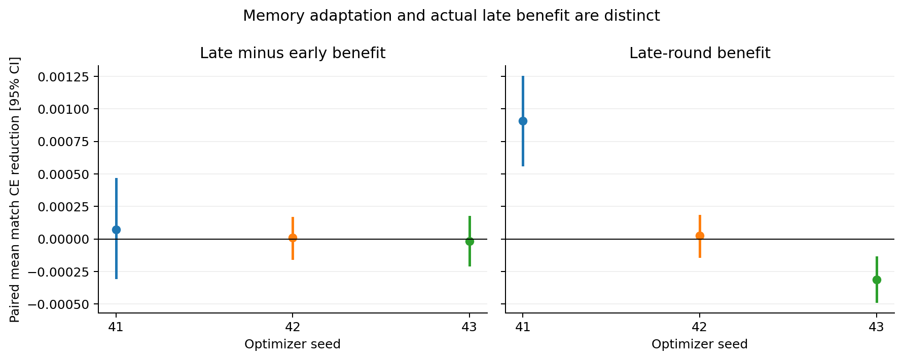

# 修正后的猜牌与跨回合记忆实验

> Historical record. The proposals, budgets and next steps below belong to
> this dated experiment. The active route is now random-start Transformer
> self-play, with old MLPs used only for evaluation; see
> [DESIGN.md](../DESIGN.md) and [STAGE_C_TODO.md](../STAGE_C_TODO.md).
> Preserve the recorded results and artifacts; do not launch an old plan as
> the new experiment or infer current provider state from its snapshot.

已完成，2026-09-22。使用训练完成的 M1 重新采集的 100,000 回合，完成 Task3 九次训练和 Task4 六次训练。全部最佳权重、逐局结果、日志和图表已保存并校验；GPU 已删除。本轮没有 RL 更新。

**当前决策：Stage B 采用 no_history；本轮 v3 记忆原型不进入正式策略。** 后续主线仍是 critic → PPO → league，再用对局胜率验证。这个决定只针对当前数据、模型和训练预算，不能据此否定真人习惯或更大规模记忆模型的价值。

## 回合内历史：结构有收益，额外历史没有稳定收益

| 模型 | 三种子平均测试 CE，越低越好 |
|---|---:|
| flat | 0.342105 |
| no_history | 0.336602 |
| history | 0.336681 |

no_history 相对 flat 的 micro CE 降低 **1.61%**。加入回合内历史后，三个种子 **1 胜 2 负**；合并的等权逐局收益为 -0.000081，95% 区间 [-0.000100, -0.000061]。因此没有稳定的额外历史收益。7/9 次训练达到 50,000 步上限，另外两次在 42,000 步提前停止；最佳权重仅由验证集选择。

[Task3 完整分解、逐种子区间与学习曲线](M2-belief-corrected.md) · [CSV](M2-belief-corrected-cells.csv) · [JSON](M2-belief-corrected-summary.json)

## 跨回合记忆：平均略好，但种子不一致，也没有适应增长证据

| 模型 | 三种子平均测试 CE，越低越好 |
|---|---:|
| memory_masked | 0.337168 |
| memory | 0.336921 |

平均 micro CE 降低约 **0.073%**，但三个种子 **2 胜 1 负**。晚期收益分别为：seed 41 显著为正，seed 42 区间跨零，seed 43 显著为负。合并整体及晚期区间虽为正，却不能替代跨种子一致性。

“适应增长”比较同一局里后期（回合序号 ≥5）和前期的记忆收益，共 **862 局**。三个种子的适应增长区间全部跨零；合并值 +0.000022，95% 区间 [-0.000130, +0.000173]。本轮没有可靠证据表明模型越打越能利用对手习惯，原定门槛为 `v3_not_yet_justified`。3/6 次训练达到上限，其他三次提前停止。

[Task4 完整分解与逐种子区间](M2-memory.md) · [CSV](M2-memory-cells.csv) · [JSON](M2-memory-summary.json)

## 数据和结论的边界

- 本轮策略来源是训练了 34,496 次更新的 M1 final，身份为 `8a8e2b08dec2e73998092a67cbc25c26df75b4c0d2f02fd0a791d5d16cd4f745`。旧六步 smoke 模型产生的结果保留在 [原报告](M2-belief-scaled.md)，两套数据不合并。
- 数据包含 5,553,998 个原始决策、18,384 个记录局。18,128 局可确认完整，256 个环境尾局可能被采集配额截断。测试集 2,757 局；保守排除其中 35 个可能截断尾局后，两阶段结论不变，适应分析仍有 860 局。
- Task3 每回合最多保留 40 个决策，验证 100,000 个决策；Task4 分别为 20 和 20,000。两阶段使用相同原始数据与划分，但保留的决策不同，不能跨表直接比较 CE。
- 注意力塔为宽度 256、四层；flat 为匹配参数量采用四层、宽度 916。参数量分别为 flat 4,660,178、history/no_history 4,662,246、memory/memory_masked 4,665,318。
- Task3 只看本回合历史。Task4 读取最多八个已结束回合的公开摘要，没有再叠加本回合 token 历史，也没有日志未记录的回合结束亮牌信息；它是记忆原型探针。
- 对手风格由合成 bot 提供，风格标签不作为模型输入。当前证据不能证明真实人类适应或对局胜率；即使记忆收益为正，仍需打乱对手历史等对照来区分习惯与其他局内信息。
- 百分比是按决策加权的 micro CE 相对变化；配对 bootstrap 区间针对等权逐局的绝对差值。重采样单位为整局，三个种子先在局内取平均，不把种子算成额外独立局。分格区间未作多重比较校正，且以这三个已训练模型为条件。
- 15 次训练中 10 次达到步数上限，因此没有“全部收敛”的结论。本轮也没有进一步扩大到更大的模型或更多原始回合。

## 运行、保存和费用

- RTX 5090，租用 **2.706 小时**，包括准备、上传、训练、评估和下载。GPU 报价 $0.99/小时，含运行存储的估算为 $0.998929/小时。
- 账户余额减少 **$2.6856**（约 $2.69），这是余额观测，非逐项账单。设定上限为 5 小时/$6；最终节点不存在，账户计费速率为 $0/小时。
- 49 项针对性测试在本地和 GPU 节点均通过；全部 15 个最佳 checkpoint 的哈希、配置、选中步数、来源和有限数值检查通过；两阶段退出码均为 0。
- 最终归档为 `/Users/xiyaowang/Documents/Projects/GuanZero/.work/runpod-next/results.tar.gz`，281,170,941 字节，SHA-256 `db51a059503f9e4cc51c896eff824bea23c7c880392ead82978a0cb59f02f2a0`。首次 SCP 在末尾超时；核对已下载前缀后续传，并校验整个归档，再删除 GPU。
- 权重及原始评估在 `/Users/xiyaowang/Documents/Projects/GuanZero/.work/runpod-next/artifacts/runs`；训练代码快照、数据归档、分析脚本、数据来源审计和运行清理证据保留在 `/Users/xiyaowang/Documents/Projects/GuanZero/.work/runpod-next`。

[运行与费用证据](/Users/xiyaowang/Documents/Projects/GuanZero/.work/runpod-next/runtime-final.json) · [15 个 checkpoint 校验](/Users/xiyaowang/Documents/Projects/GuanZero/.work/runpod-next/checkpoints-verified.json) · [提供方最终状态](/Users/xiyaowang/Documents/Projects/GuanZero/.work/runpod-next/provider-verification.json)
