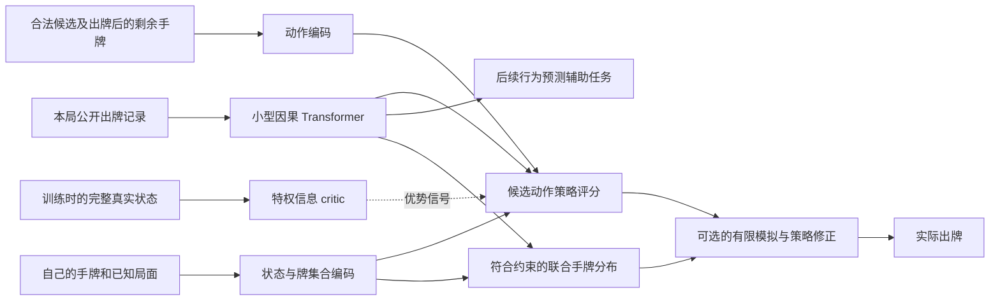

# GuanZero 模型路线研究：Transformer、推断与搜索

> Historical record. The proposals, budgets and next steps below belong to
> this dated experiment. The active route is now random-start Transformer
> self-play, with old MLPs used only for evaluation; see
> [DESIGN.md](../DESIGN.md) and [STAGE_C_TODO.md](../STAGE_C_TODO.md).
> Preserve the recorded results and artifacts; do not launch an old plan as
> the new experiment or infer current provider state from its snapshot.

调研日期：2026-09-23。仓库读取快照：`a18b2d41e05429fc7a1cd9d6f31ae84963618834`。本文是研究建议，不是新增训练结果。只新增此文档；没有启动训练或评测，没有更改训练、性能优化代码或运行中的进程。其他 session 的在途结果不在本文结论内。

**判断：现有自博弈、PPO、特权信息 critic 和联赛路线值得继续。Transformer 适合掼蛋，值得重新做直接参与决策的实验；目前还不能认定它在我们的预算下优于 MLP。追求更高上限，我最看好局内历史表示、符合规则的联合手牌推断、有限搜索的组合。**

“比所有市面产品都强”需要可接触的对手、统一规则和时间限制才能验证。当前能设定的严谨目标是：在约定规则和推理预算下，击败可获得的强模型，并通过陌生搭档和人类对局检验。未公开商业模型没有可核实的统一强度排名。

**一、现有路线已经有什么证据**

| 读取到的事实 | 能支持的判断 | 证据边界 |
|---|---|---|
| B6 的 PPO 对同训练时长的继续 DMC 赢 318/500 场，95% Wilson 区间 59.3%–67.7%；重复牌局净升级收益 +0.256 [0.219, 0.292] | 这组预算下，PPO 配方值得保留 | 每臂一个训练 seed；不是对公开强模型的胜率，也未单独隔离 critic 的贡献 |
| B8 联赛对固定对手训练版本赢 552/1000 场；净升级收益 +0.087 [0.061, 0.110] | 对手分布确实影响牌力 | 原 G3 有条款失败，后来按用户修订的标准通过；不能抹掉这一历史 |
| B9 专门训练约两小时的 exploiter 从很弱的起点追到对联赛约 40% 场胜率 | 当前模型仍有可学习的漏洞；值得继续引入针对性对手 | 固定预算攻击强度是经验指标，不是精确博弈论 exploitability |
| 修正来源的 100,000 局监督实验中，history 相对 no_history 赢一个 seed、输两个；平均 CE 0.336681 vs 0.336602 | 当前 history 配方没有通过既定监督门槛 | 不能据此排除 Transformer 直接优化决策、不同目标或不同数据分布的收益 |
| 跨局 memory 的收益不稳定，三个 seed 的 adaptation 区间都跨零 | 跨局记忆暂时低于局内决策实验的优先级 | 不是证明对手习惯没有价值 |

来源：[B6](stage-b-ppo.md)、[B8](stage-b-league.md)、[B9](stage-b-exploiter.md)、[修正后的局内 history 实验](M2-belief-corrected.md)、[跨局 memory 实验](M2-memory.md)。这些数值来自本次读取的报告；没有重新运行实验。

当前实际出牌模型仍是 `train/model.py` 的状态 MLP、动作 MLP 和融合评分头。`no_history` 监督对照中的 query tower，并没有因此自动成为 Stage B 出牌模型。`train/ppo.py` 已有完美信息 critic、手牌和名次辅助损失；B11 的实时 exploiter 导入代码也已经存在。这些不应被当作本次新增建议重复实现。

另一个直接相关的限制来自 `train/policy.py`：PPO 在**冻结 M1 的 top-32 加合法 pass**上选择动作。更强的策略仍会受这个旧候选集合限制。它是否已成为显著瓶颈尚未测量，但这是有明确代码依据的假设。

**二、外部研究更新了哪些判断**

下面区分论文实验、作者仓库报告和迁移到掼蛋的研究假设。查阅到的近期工作不意味着穷尽了所有商业系统。

| 工作与日期 | 直接证据 | 对 GuanZero 的启发与限制 |
|---|---|---|
| [DanLM，2026 年公开仓库](https://github.com/dashidhy/DanLM) | 历史 Transformer + 手牌/动作 MLP，以 DMC 与下一 token 预测共同训练；作者报告对其增强复现 DanZero V1T 的单局胜率 59.6%，整场 74.9%，各 1000 次、一个评测 seed | 最接近的架构参照。是作者报告，尚未由我们复现；其 DanZero 复现不等于原作者 checkpoint，也未建立对 GS2 的统一排名 |
| [FableDan，2026 年可查的公开实现](https://github.com/lrx0716/FableDan) | 提供 Transformer、DMC、NTP 和 belief 辅助训练源码；本次读了模型实现 | 可以核对工程设计；没有在此次调研中验证其榜单排名或强模型对战成绩 |
| [OpenGuanDan，2026-01-31 首次提交](https://arxiv.org/html/2602.00676v1) | GS2 对其 SDMC blueprint 整场胜率 56.7%；被测 GS2 对人类样本单局 45/106 | 掼蛋里已有搜索收益。人类样本小、对手经验分布不均，不能推广成所有现有 AI 的水平 |
| [Reevaluating Policy Gradient Methods，ICLR 2026](https://proceedings.iclr.cc/paper_files/paper/2026/hash/fe1c4991d57f37dfef62d01b3901ca54-Abstract-Conference.html) | 在所测不完全信息游戏和超过 7000 次训练中，专门的 FP/DO/CFR 深度算法没有优于通用策略梯度方法 | 支持继续认真优化 PPO；不是 PPO 在所有掼蛋设定最优的证明 |
| [Ataraxos，2025-11](https://arxiv.org/html/2511.07312v1) | Stratego 使用 Transformer、自博弈、联合隐藏信息生成和决策时搜索；对顶尖选手 15 胜、4 和、1 负 | 强调表示、稳定策略更新和搜索的组合。最终策略训练用了 16 H100 一周，belief 另用 4 H100 四天；不是单卡预算的直接复现承诺 |
| [Test-time RL in Imperfect Information Games，2026-08-31](https://arxiv.org/html/2608.30635v1) | 研究用策略梯度与生成式 belief 做测试时子博弈求解，并分析正则化；实验涵盖 Goofspiel、Battleship 等 | 最新且值得跟进。有限计算下仍可能退化；两人零和理论不能直接覆盖掼蛋四个分散信息的座位 |
| [A Generalist Hanabi Agent / R3D2，ICLR 2025](https://arxiv.org/abs/2503.14555) | 研究不同人数、不同搭档之间的策略迁移和合作 | “两个自己很强”与“搭陌生玩家很强”应分别评测；Hanabi 的结果不是掼蛋增益证据 |
| [Big 2 自博弈，2026-05，6 月修订](https://arxiv.org/html/2605.28863v2) | 小预算实验中，牌集合注意力与候选评分配合 PPO 有效；当前策略自博弈优于其历史池实验 | 可以借鉴牌集合表示，并保留简单自博弈对照；这是四人各自竞争且多数结果单 seed 的相邻游戏 |
| [PaW，2026-06，9 月修订](https://arxiv.org/abs/2606.02388)；[ECHO，2026-05](https://arxiv.org/abs/2605.24517) | 在语言 agent 中把后续观测预测与策略学习结合 | 支持研究更密集的预测监督；它们没有直接证明掼蛋收益 |

DanLM 本次检查的仓库树为 `16ace5ada4db39086bb4c8ebb372ed16cb82fab1`：存在发布权重，但关键模型、编码器、引擎多为 CPython 3.12 macOS 二进制扩展，没有看到完整训练源码。不能把“有权重”描述成“训练全开源”。FableDan 检查版本为 `7cc5e311b9860bc44f76c082d9c1b21fc8b2d3ec`，有可读训练源码，README 说明权重未纳入 git。两者都需要规则和动作协议核对后才能成为我们的对战基线。

`docs/DESIGN.md` 中“没有已发表的掼蛋 agent 用这种 history Transformer”的创新性叙述需要重新限定：无论这些仓库是否同行评审，公开先例已经存在。单纯“加 Transformer”不足以构成研究差异点。本文没有修改其他 session 可能正在使用的设计文档。

**三、Transformer 为什么适合，以及旧实验为什么没有给出最终答案**

掼蛋的观测包含三种结构：手牌是带重数的集合；出牌记录有时间顺序；四个座位有队友和对手关系。集合注意力可以表示牌之间的组合关系，因果注意力可以回看特定时刻的出牌，座位标记可以保留合作关系。这些都是值得验证的归纳偏置。

例如，对手在队友领先时过牌，与对手面对即将出完的敌方时过牌，含义不同。历史有助于判断“没法压”与“选择不压”。**过牌不是没有大牌的硬约束**。推断需要结合行为策略，而不只是记牌。

旧 probe 主要衡量每个隐藏座位、每种牌的 0/1/2 张分类损失。这个目标有三个局限：

1. 当前 1849 维输入已经含自己手牌、未见牌、各家累计出牌、余牌数和最近动作。history 必须提供额外行为信息才会胜出，简单记牌优势已被强对照消化。
2. 平均预测误差与行动价值并不等价。准确判断对方是否能接住某副对子，可能比修正许多无关牌的概率更影响胜负。应增加未确定牌、关键行动局面、队友/对手分组诊断。
3. 每张牌分别预测的边缘概率，不自动形成一副满足人数、张数和牌池约束的联合分牌。它适合辅助表征，不能直接逐张独立采样后拿去搜索。

这解释了为什么应保留旧实验的负结果，同时测试**不同训练目标下的出牌策略**。它没有证明这些假设成立。新的实验必须让胜负梯度进入 history encoder，并用牌力决定是否保留。两层宽 128 的旧 prototype 也没有覆盖所有规模，但“加大就会好”同样没有证据。

无需先用十亿参数自然语言模型。建议从 2–4 层、宽 128–256 的专用历史编码器开始，作为待测配置；可配 RoPE、RMSNorm 等现代模块，但这些细节不是已经验证的主要增益来源。更大网络会减少同预算的自博弈数据，必须同时比较样本效率和实际训练时间。

**四、建议的候选系统**

这是逐步验证的候选组合，不建议一次同时替换全部组件。

保留当前合法动作枚举和可用状态特征，给策略加一个 history 分支。先将同一局的公开历史编码一次，再让每个私有状态查询它。可以用很小但非零的 history 残差权重从已有强策略开始；严格零输出初始化可能暂时阻断 encoder 梯度，需要检查。新模型的蒸馏或初始化成本计入架构比较预算。

动作编码值得加入 **afterstate**：打出候选牌后，自己的手牌还剩什么。例如同样打出一副对子，一种打法拆掉关键顺子，另一种保留炸弹；显式表示剩余手牌可能帮助学习。先用相同信息的 MLP 对照，再测集合注意力，才能分清收益来自新增信息还是注意力。

辅助预测先从真实轨迹上的下一次非强制出牌入手，区分队友和对手，预测过牌/牌型/主值等。预测发生在自己动作之后时，可以以该候选动作为条件。**只观察到实际执行动作的后果，不能将其伪造为所有未执行动作的监督标签。** 未执行动作需要模拟或其他合法估计。

NTP 可能被确定性的座位、格式符号、强制 pass 和自己的行为占据大部分损失。将这些部分分开记分、调整权重，检验模型是否真的更懂他人的响应。PPO 提供策略改进方向，预测损失提供表征监督。对手的真实合法动作集合也依赖隐藏手牌，部署预测头不能拿这个集合做泄漏信息的 mask。

共享 history 流只能含公开信息；自己的手牌和合法可知的私有交换信息通过私有分支进入。teacher forcing 的下一事件标签不能进入当前出牌的上下文。模型更新后需要重算或失效旧 KV/hidden state，序列训练也要保证每个决策只读自身前缀。

**五、最值得先做的三个实验**

**实验 A：量化旧 M1 的动作筛选是否限制上限。优先级最高，成本相对低。**

先统计实际发生剪枝的比例、各阶段候选数、被剪掉的牌型和特殊牌使用。检查当前策略在完整 canonical 集合上偏好的动作有多少被 M1 排除；这只是分歧指标，因为未训练动作的 logit 可能不可靠。

随后用规则一致的受限模拟核查这些分歧局面，再训练一个小对照：固定 top-32 对比逐渐扩大到 64/128，或“旧候选 + 当前策略候选 + 少量多样探索”。每份 rollout 保存实际采样集合和行为概率，PPO 重算必须使用相同集合；不能在更新中悄悄改变 support。完整 concrete 动作与 canonical 缩减是第二层独立问题，也应抽样审计。

成功条件是新的候选机制在同训练预算下提高重复牌局收益，并通过完整场次评测。仅仅出现 top-32 外的动作不构成成功。推理时直接解开剪枝也不能替代训练对照。

**实验 B：让局内 history 直接优化出牌，联合学习后续行为。主架构候选。**

先进行管线和梯度检查，再安排三个主要训练臂：相同状态信息的 MLP；MLP + history Transformer；MLP + history Transformer + 行为预测辅助目标。所有臂使用相同 PPO、critic、对手日程和动作集合，保留现有辅助任务。若出现收益，再加 GRU + 相同预测任务的便宜对照，判断收益是否真的需要 attention。用 history 打乱或遮蔽诊断实际依赖，而不把打乱后的非法游戏序列作为真实监督轨迹。

先以相同环境决策数诊断学习效率，再以相同硬件、实际训练时间判定是否值得采用。并行占用同一 GPU 的臂会互相争用，必须固定资源或轮换运行；训练时间相同不自动代表资源相同。至少三个独立训练 seed，初始化和离线预训练计入成本。

首轮筛选在预先固定的 validation 对手上完成，选定后只在未用于调参的测试牌局和对手上评测。建议最终报告 10,000 组重复牌局净升级收益和至少 1,000 场完整比赛，并按效果大小决定是否还需要更多样本。采用门槛可预注册为：等预算重复牌局收益的 95% 区间高于零、完整场胜率区间高于 50%、没有预先定义的重大跨对手退化。置信区间按整组牌局/整场聚类，训练 seed 单独展示；不能把很多相关决策当成独立样本。

如果模型只改善 CE，或等样本更强而等时间更弱，保留为研究结果，不直接替换主模型。第一轮较小预算的失败也只能否定该配置，不能宣称否定整个架构。

**实验 C：联合 belief + 受限搜索。更高上限的第二阶段候选。**

逐步分配未见牌，产生三家完整、互相一致的手牌样本。使用当前余牌数、两副牌的总重数、已经公开的持牌等硬约束；把过牌和风格作为软的行为证据。比较“均匀合法分牌”和“学习的分牌分布”，识别收益究竟来自搜索还是推断。

先在少牌残局，对相同一组可能分牌和相同随机数比较候选动作。root 动作在所有样本间共享；后续每个模拟玩家只看自己在该样本中依法可见的信息，不能读全桌真实手牌。普通逐分牌全知最优搜索会产生 strategy fusion，即假装未来能根据尚未知道的牌选不同策略，导致虚假乐观。

可以先固定后续 blueprint 策略，用多次 rollout 估计 root 动作价值，再对原策略做有 KL 约束的小幅修正。这个做法是经验算法，不获得 ReBeL 或两人零和子博弈理论的自动安全保证。critic 的叶节点值也必须对应所模拟的后续策略，不能把完美信息最优价值当作真实可达价值。

做无搜索、均匀 belief 搜索、学习 belief 搜索三臂，对 20/100/500 毫秒等推理预算画强度曲线。这些时间是待测预算点，不是已实现速度。先验证预算内真实胜率提升，再扩展到中盘关键局面。蒸馏搜索结果值得后续测试，但必须单独验证总训练成本收益；Ataraxos 的结果提醒我们，训练时到处加搜索可能降低数据产量而得不偿失。

**六、发散候选与取舍**

| 方向 | 为什么可能提高牌力 | 当前建议 |
|---|---|---|
| afterstate、牌集合/牌组表示、候选对历史做 cross-attention | 将拆牌代价、后续组合和行动相关线索呈现给评分头 | 紧随 A/B 的便宜对照；不要把增加特征与更换架构同时归因 |
| 对整场胜利建模，或预测各名次组合后接 match value | 当前 PPO 以本局回报为终点；局部升级收益与最终获胜概率不完全等价 | 先做 value 诊断，再用小权重联合目标或有边界条件的 potential shaping；检查 A 级和进贡局面 |
| 稳定策略更新、KL/熵/学习率协同调度 | 不完全信息自博弈可能循环或过早确定化 | 借鉴 Ataraxos 的机制，与现有 PPO 逐项消融；不因新论文而整体换算法 |
| exploiters、难度合适的对手采样、多样主策略 | 防止只学会击败自己家族的弱点 | 已有 B11 实现，应接续正在进行的工作；保留简单当前策略自博弈对照，池越大不一定越好 |
| 陌生搭档训练、partner embedding、cross-play | 自己和自己配合的强度不保证搭人类的强度 | 如果产品是助手/陪打，这一项升为主目标；如果是固定 AI 队，则做独立鲁棒性指标 |
| 跨局风格 posterior / 少样本适应 | 可能识别对手保炸、冒险、协作倾向 | 后置。用新采集的多风格强策略轨迹、换座位/换历史对照验证，不能仅凭后几局分数提高认定学会适应 |
| distributional value / 多头集成 / 关键局面自适应搜索 | 表达不同结果概率，把算力用于策略分歧大的局面 | 研究候选；风险偏好应由最终获胜目标决定，固定保守惩罚可能压低牌力 |
| 教师或搜索轨迹蒸馏 | 更快学会罕见残局和配合 | 允许训练期特权信息，但执行策略只看合法观测；单一全知动作标签可能冲突，必须保留不确定性 |
| 更大 Transformer、MoE、Mamba 等 | 可能改善容量或速度 | 先取得规模曲线和实际瓶颈证据；当前没有足够依据把某个名称设为主方向 |
| 端到端学习规则的通用 world model / 大语言模型直接出牌 | 可能带来通用性 | 对当前牌力目标优先级低。已有准确引擎，新增学习重点是隐藏信息与玩家行为；模型仍可在研究、数据和解释层面发挥作用 |

一个值得单独研究的问题是：**在相同推理预算下，以“预测其他玩家对候选牌的响应”为目标训练 history 表征，是否比逐牌 hidden-hand CE 更能改善策略或搜索？** DanLM/FableDan 已覆盖 history + RL + NTP，GS2/Ataraxos 已覆盖 belief 与搜索，因此以上问题只是可检验的候选差异点，尚未完成足以声称论文创新的穷尽审查。

**七、第一周应得到哪些决策依据**

按依赖顺序安排，具体 GPU 时间由运行吞吐与现有训练占用决定：

1. 固定已完成的强 checkpoint、规则配置与对手名单；建立 DanLM 的规则/接口差异清单。这个外部强基线优先于继续只对 M1 报胜率。
2. 完成实验 A 的剪枝覆盖和反例分析；给出“是否值得释放候选”的证据。
3. 完成实验 B 的三臂小规模训练和验证集筛选；先回答 history 是否被策略真正使用，再决定多 seed 扩展。GRU 是自然的备用方案。
4. 用已有强策略做 C 的少牌残局原型，先验证推断样本合法、模拟没有全知信息泄漏、增加思考时间是否改善动作。
5. 在本周结果上做继续/停止决定：B 若在实际预算下有稳定牌力收益，扩展并联接 C；B 若暂不成立，继续现有 PPO 主线，优先验证 A 和 C。不要靠不断增加组件绕过负结果。

外部评测要分别保留整场胜率、单局净升级、对不同策略的完整对战矩阵、陌生搭档和人类测试。榜单、规则不同的论文胜率、单一 Elo 和对旧 checkpoint 的高胜率，都不能互相替代。每次提升均记录训练成本和每步推理延迟，才知道它提升的是实际可用牌力还是仅在更多计算下的成绩。
